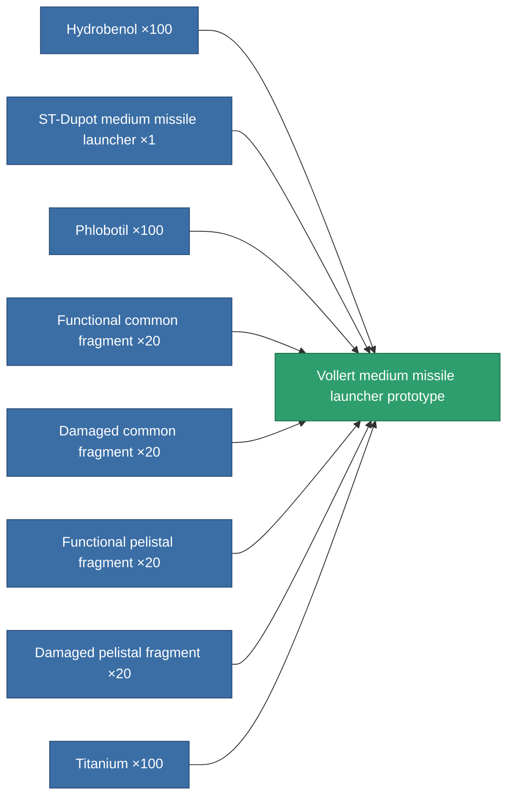

<!-- Generated by tools/generate from the live database (source: entitydefaults definition 2310, aggregatevalues via aggregatefields).
     Do not edit by hand; regenerate instead. -->

# Vollert medium missile launcher prototype

|  |  |
|---|---|
| Definition | `def_named2_missile_launcher_pr` |
| Tier | 3 |
| Health | 100 |
| Volume | 2 |
| Mass | 500 |
| Category | Modules / Weapons |

## Stats

| Field | Value |
|---|---|
| accuracy | 1 |
| core_usage | 2 |
| cpu_usage | 40 |
| cycle_time | 12k |
| damage_modifier | 1 |
| module_missile_range_modifier | 1.1 |
| powergrid_usage | 152 |

<!-- production:generated -->
## Production

**Produced from 8 components, research level 6** — assemble the components to build it (see [Recipes](/content/recipes/) for the full list):

[All items](/content/items/)
