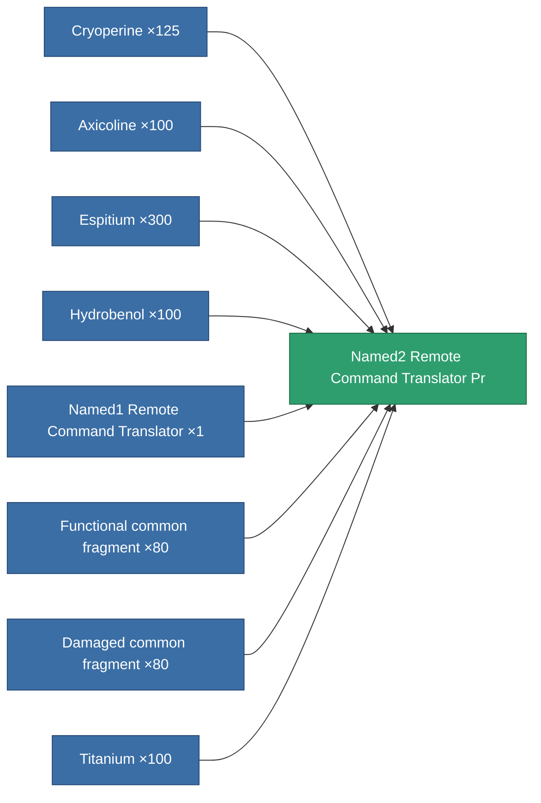

<!-- Generated by tools/generate from the live database (source: entitydefaults definition 8837, aggregatevalues via aggregatefields).
     Do not edit by hand; regenerate instead. -->

# Named2 Remote Command Translator Pr

|  |  |
|---|---|
| Definition | `def_named2_remote_command_translator_pr` |
| Tier | 3 |
| Health | 100 |
| Volume | 2.5 |
| Mass | 1250 |
| Category | Modules / Remote control |

## Stats

| Field | Value |
|---|---|
| core_usage | 10 |
| cpu_usage | 129 |
| cycle_time | 9k |
| drone_remote_command_translation_armor_max_modifier | 1.1 |
| drone_remote_command_translation_damage_modifier | 1.05 |
| drone_remote_command_translation_harvesting_amount_modifier | 1.05 |
| drone_remote_command_translation_mining_amount_modifier | 1.05 |
| drone_remote_command_translation_remote_repair_amount_modifier | 1.05 |
| drone_remote_command_translation_retreat | 0.001 |
| powergrid_usage | 64 |
| remote_control_bandwidth_max_modifier | 5 |
| remote_control_lifetime_modifier | 150k |
| remote_control_operational_range_modifier | 15 |

<!-- production:generated -->
## Production

**Produced from 8 components, research level 7** — assemble the components to build it (see [Recipes](/content/recipes/) for the full list):

[All items](/content/items/)
