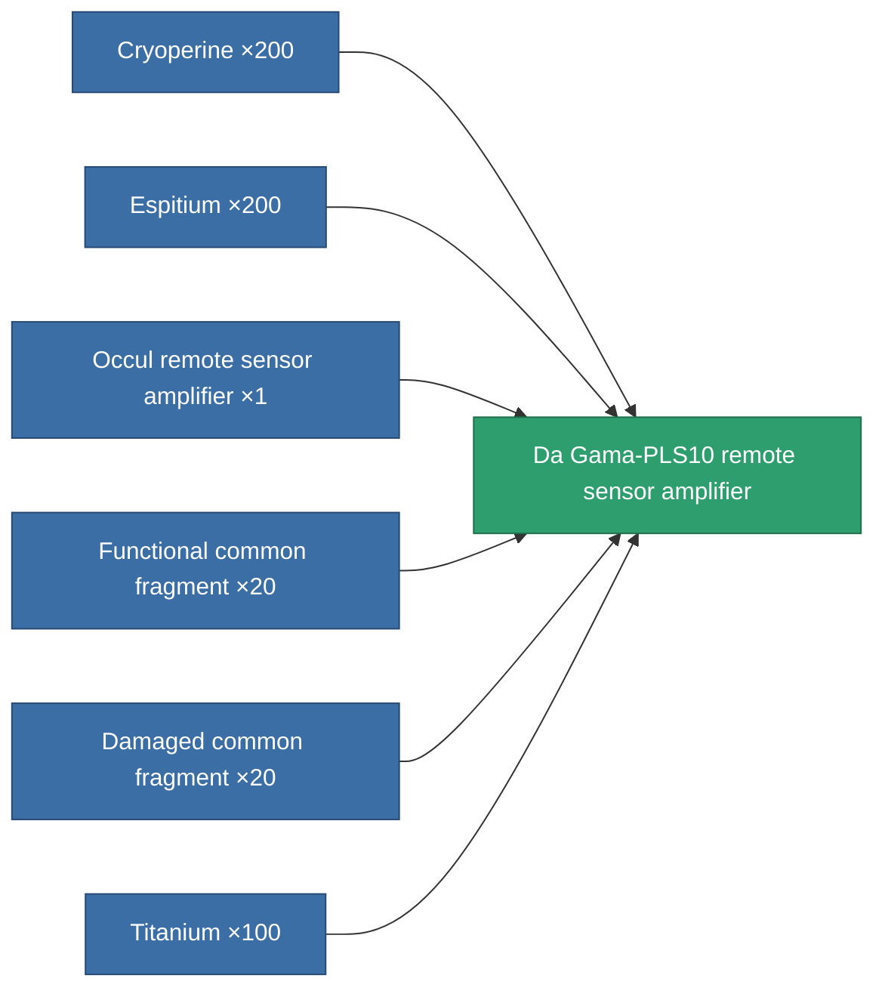
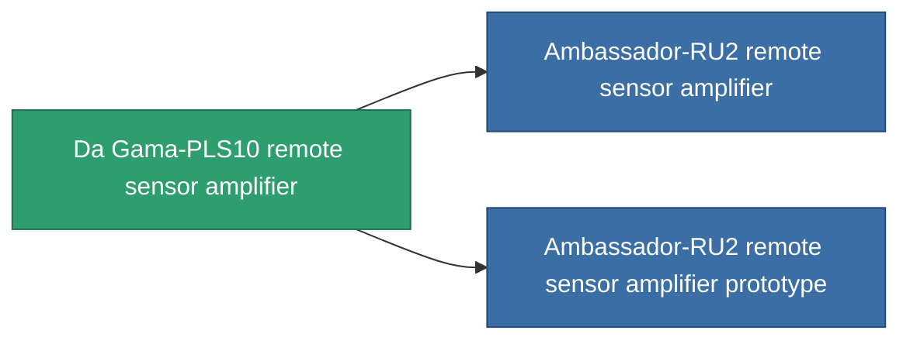

<!-- Generated by tools/generate from the live database (source: entitydefaults definition 772, aggregatevalues via aggregatefields).
     Do not edit by hand; regenerate instead. -->

# Da Gama-PLS10 remote sensor amplifier

|  |  |
|---|---|
| Definition | `def_named2_remote_sensor_booster` |
| Tier | T3 |
| Health | 100 |
| Volume | 0.5 |
| Mass | 100 |
| Category | Modules / Sensors & scanning |
| Tier line | [Standard remote sensor amplifier](/content/items/standard-remote-sensor-booster/) (T1) → [Occul remote sensor amplifier](/content/items/named1-remote-sensor-booster/) (T2) → **Da Gama-PLS10 remote sensor amplifier** (T3) → [Ambassador-RU2 remote sensor amplifier](/content/items/named3-remote-sensor-booster/) (T4) |

## Stats

| Field | Value |
|---|---|
| core_usage | 14 |
| cpu_usage | 23 |
| cycle_time | 10k |
| effect_sensor_booster_locking_range_modifier | 1.4 |
| effect_sensor_booster_locking_time_modifier | 0.75 |
| falloff | 0 |
| optimal_range | 30 |
| powergrid_usage | 7 |

<!-- production:generated -->
## Production

**Produced from 6 components, research level 5** — assemble the components to build it (see [Recipes](/content/recipes/) for the full list):

## Used in production

**Component of 2 items** — everything that uses it in production:

[All items](/content/items/)
