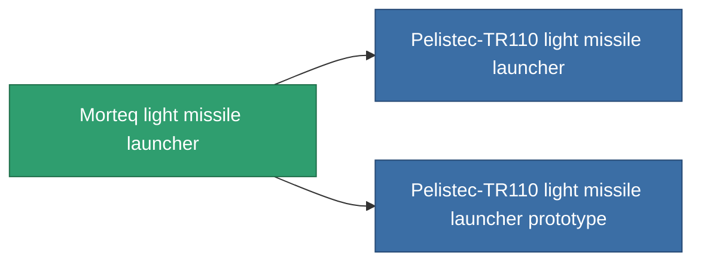

<!-- Generated by tools/generate from the live database (source: entitydefaults definition 850, aggregatevalues via aggregatefields).
     Do not edit by hand; regenerate instead. -->

# Morteq light missile launcher

|  |  |
|---|---|
| Definition | `def_named2_rocket_launcher` |
| Tier | T3 |
| Health | 100 |
| Volume | 1 |
| Mass | 250 |
| Category | Modules / Weapons |
| Tier line | [Standard light missile launcher](/content/items/standard-rocket-launcher/) (T1) → [Pelistec-Horosol DBM light missile launcher](/content/items/named1-rocket-launcher/) (T2) → **Morteq light missile launcher** (T3) → [Pelistec-TR110 light missile launcher](/content/items/named3-rocket-launcher/) (T4) |

## Stats

| Field | Value |
|---|---|
| accuracy | 1 |
| core_usage | 1 |
| cpu_usage | 32 |
| cycle_time | 7k |
| damage_modifier | 1 |
| module_missile_range_modifier | 1.1 |
| powergrid_usage | 27 |

<!-- production:generated -->
## Production

**Produced from 8 components, research level 4** — assemble the components to build it (see [Recipes](/content/recipes/) for the full list):

<svg class="prod-card-icon" aria-hidden="true"><use href="#mi-grid"/></svg><a class="prod-card-name" href="/content/items/hydrobenol/">Hydrobenol</a>

required: <b>50</b>

<svg class="prod-card-icon" aria-hidden="true"><use href="#mi-star"/></svg><a class="prod-card-name" href="/content/items/named1-rocket-launcher/">Pelistec-Horosol DBM light missile launcher</a>

required: <b>1</b>

<svg class="prod-card-icon" aria-hidden="true"><use href="#mi-grid"/></svg><a class="prod-card-name" href="/content/items/phlobotil/">Phlobotil</a>

required: <b>50</b>

<svg class="prod-card-icon" aria-hidden="true"><use href="#mi-crystal"/></svg><a class="prod-card-name" href="/content/items/robotshard-common-advanced/">Functional common fragment</a>

required: <b>10</b>

<svg class="prod-card-icon" aria-hidden="true"><use href="#mi-crystal"/></svg><a class="prod-card-name" href="/content/items/robotshard-common-basic/">Damaged common fragment</a>

required: <b>10</b>

<svg class="prod-card-icon" aria-hidden="true"><use href="#mi-crystal"/></svg><a class="prod-card-name" href="/content/items/robotshard-pelistal-advanced/">Functional pelistal fragment</a>

required: <b>10</b>

<svg class="prod-card-icon" aria-hidden="true"><use href="#mi-crystal"/></svg><a class="prod-card-name" href="/content/items/robotshard-pelistal-basic/">Damaged pelistal fragment</a>

required: <b>10</b>

<svg class="prod-card-icon" aria-hidden="true"><use href="#mi-grid"/></svg><a class="prod-card-name" href="/content/items/titanium/">Titanium</a>

required: <b>50</b>

## Used in production

**Component of 2 items** — everything that uses it in production:

