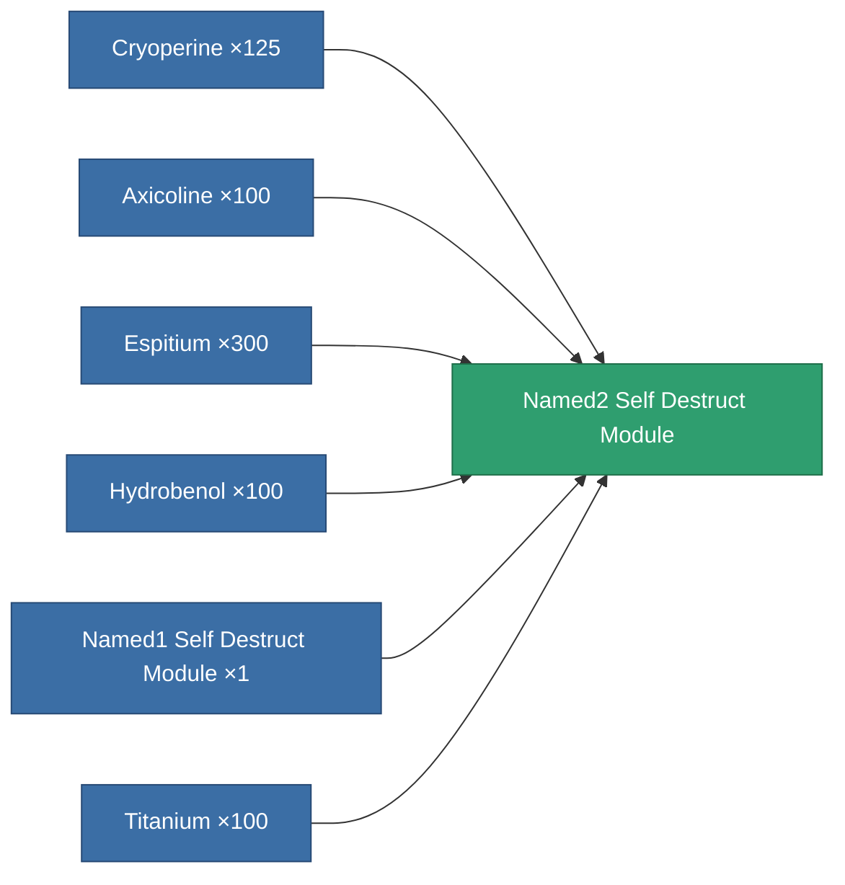
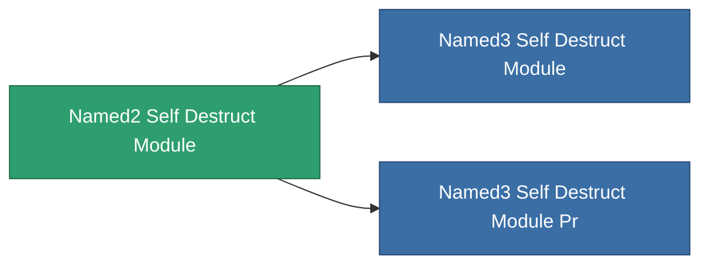

<!-- Generated by tools/generate from the live database (source: entitydefaults definition 8983, aggregatevalues via aggregatefields).
     Do not edit by hand; regenerate instead. -->

# Named2 Self Destruct Module

|  |  |
|---|---|
| Definition | `def_named2_self_destruct_module` |
| Tier | 3 |
| Health | 100 |
| Volume | 100 |
| Mass | 450 |
| Category | Modules / Enhancements |
| Note | Kamikaze self-destruct module: arms an un-cancellable delayed detonation that kills the owner. |

## Stats

| Field | Value |
|---|---|
| core_usage | 60 |
| cpu_usage | 50 |
| powergrid_usage | 24 |

<!-- production:generated -->
## Production

**Produced from 6 components** — assemble the components to build it (see [Recipes](/content/recipes/) for the full list):

## Used in production

**Component of 2 items** — everything that uses it in production:

[All items](/content/items/)
