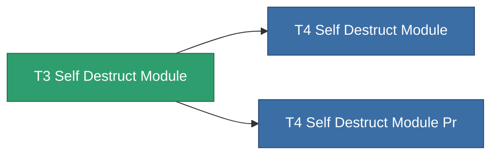

<!-- Generated by tools/generate from the live database (source: entitydefaults definition 8983, aggregatevalues via aggregatefields).
     Do not edit by hand; regenerate instead. -->

# T3 Self Destruct Module

|  |  |
|---|---|
| Definition | `def_named2_self_destruct_module` |
| Tier | T3 |
| Health | 100 |
| Volume | 100 |
| Mass | 450 |
| Category | Modules / Enhancements |
| Tier line | [Standard Self Destruct Module](/content/items/standard-self-destruct-module/) (T1) → [T2 Self Destruct Module](/content/items/named1-self-destruct-module/) (T2) → **T3 Self Destruct Module** (T3) → [T4 Self Destruct Module](/content/items/named3-self-destruct-module/) (T4) |
| Note | Kamikaze self-destruct module: arms an un-cancellable delayed detonation that kills the owner. |

## Stats

| Field | Value |
|---|---|
| core_usage | 60 |
| cpu_usage | 50 |
| powergrid_usage | 24 |

<!-- production:generated -->
## Production

**Produced from 6 components** — assemble the components to build it (see [Recipes](/content/recipes/) for the full list):

<svg class="prod-card-icon" aria-hidden="true"><use href="#mi-grid"/></svg><a class="prod-card-name" href="/content/items/axicol/">Cryoperine</a>

required: <b>125</b>

<svg class="prod-card-icon" aria-hidden="true"><use href="#mi-grid"/></svg><a class="prod-card-name" href="/content/items/axicoline/">Axicoline</a>

required: <b>100</b>

<svg class="prod-card-icon" aria-hidden="true"><use href="#mi-grid"/></svg><a class="prod-card-name" href="/content/items/espitium/">Espitium</a>

required: <b>300</b>

<svg class="prod-card-icon" aria-hidden="true"><use href="#mi-grid"/></svg><a class="prod-card-name" href="/content/items/hydrobenol/">Hydrobenol</a>

required: <b>100</b>

<svg class="prod-card-icon" aria-hidden="true"><use href="#mi-panel"/></svg><a class="prod-card-name" href="/content/items/named1-self-destruct-module/">T2 Self Destruct Module</a>

required: <b>1</b>

<svg class="prod-card-icon" aria-hidden="true"><use href="#mi-grid"/></svg><a class="prod-card-name" href="/content/items/titanium/">Titanium</a>

required: <b>100</b>

## Used in production

**Component of 2 items** — everything that uses it in production:

