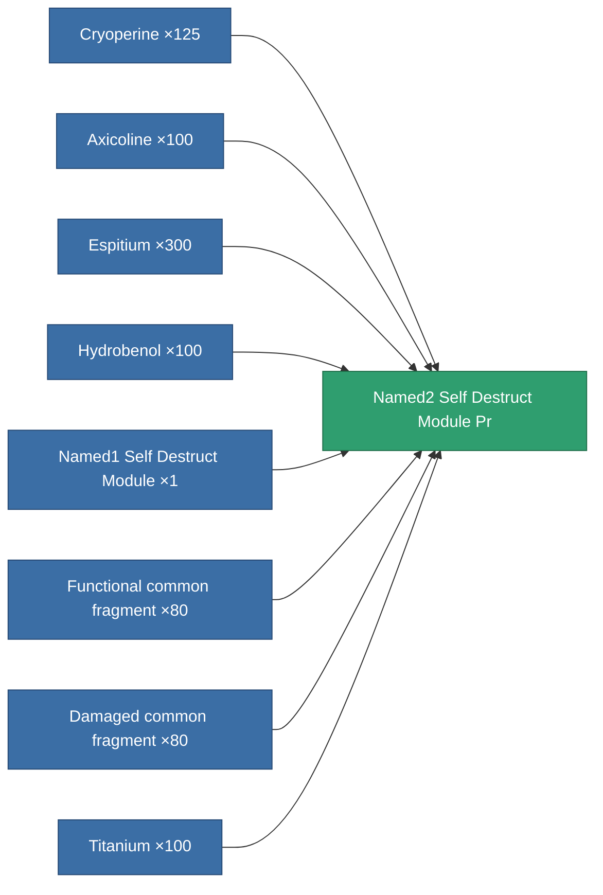

<!-- Generated by tools/generate from the live database (source: entitydefaults definition 8984, aggregatevalues via aggregatefields).
     Do not edit by hand; regenerate instead. -->

# Named2 Self Destruct Module Pr

|  |  |
|---|---|
| Definition | `def_named2_self_destruct_module_pr` |
| Tier | T3 (prototype) |
| Health | 100 |
| Volume | 100 |
| Mass | 400 |
| Category | Modules / Enhancements |
| Tier line | [Standard Self Destruct Module](/content/items/standard-self-destruct-module/) (T1) → [Named1 Self Destruct Module](/content/items/named1-self-destruct-module/) (T2) → [Named2 Self Destruct Module](/content/items/named2-self-destruct-module/) (T3) → **Named2 Self Destruct Module Pr** (T3) → [Named3 Self Destruct Module](/content/items/named3-self-destruct-module/) (T4) |
| Note | Kamikaze self-destruct module: arms an un-cancellable delayed detonation that kills the owner. |

## Stats

| Field | Value |
|---|---|
| core_usage | 60 |
| cpu_usage | 48 |
| powergrid_usage | 23 |

<!-- production:generated -->
## Production

**Produced from 8 components, research level 7** — assemble the components to build it (see [Recipes](/content/recipes/) for the full list):

[All items](/content/items/)
