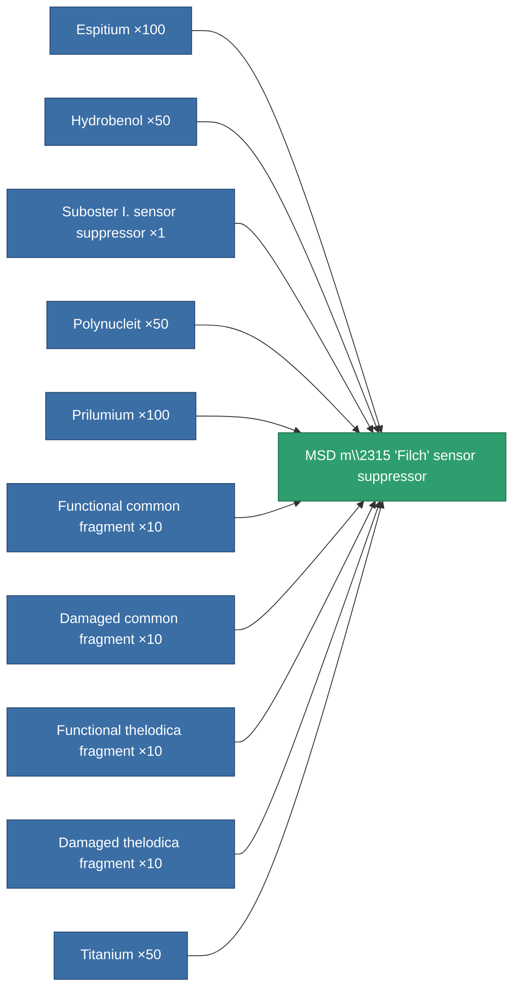
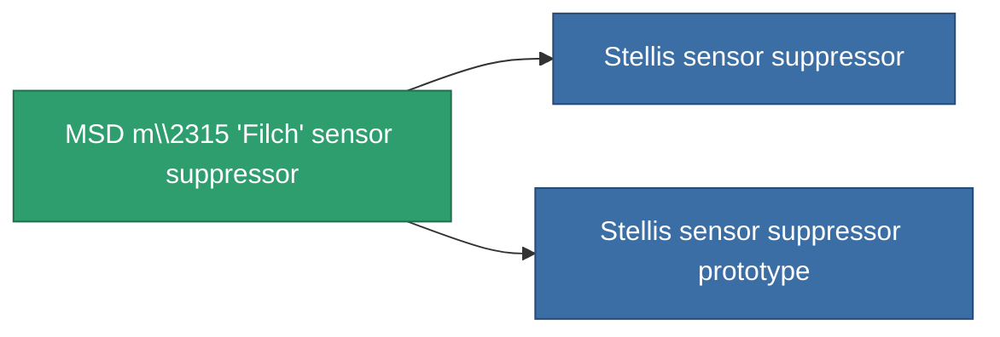

<!-- Generated by tools/generate from the live database (source: entitydefaults definition 793, aggregatevalues via aggregatefields).
     Do not edit by hand; regenerate instead. -->

# MSD m\2315 'Filch' sensor suppressor

|  |  |
|---|---|
| Definition | `def_named2_sensor_dampener` |
| Tier | T3 |
| Health | 100 |
| Volume | 0.5 |
| Mass | 150 |
| Category | Modules / Sensors & scanning |
| Tier line | [Standard sensor suppressor](/content/items/standard-sensor-dampener/) (T1) → [Suboster I. sensor suppressor](/content/items/named1-sensor-dampener/) (T2) → **MSD m\2315 'Filch' sensor suppressor** (T3) → [Stellis sensor suppressor](/content/items/named3-sensor-dampener/) (T4) |

## Stats

| Field | Value |
|---|---|
| core_usage | 18 |
| cpu_usage | 36 |
| cycle_time | 5k |
| ecm_strength | 65 |
| effect_sensor_dampener_locking_range_modifier | 0.8 |
| effect_sensor_dampener_locking_time_modifier | 1.35 |
| falloff | 0 |
| optimal_range | 33 |
| powergrid_usage | 21 |

<!-- production:generated -->
## Production

**Produced from 10 components, research level 5** — assemble the components to build it (see [Recipes](/content/recipes/) for the full list):

## Used in production

**Component of 2 items** — everything that uses it in production:

[All items](/content/items/)
