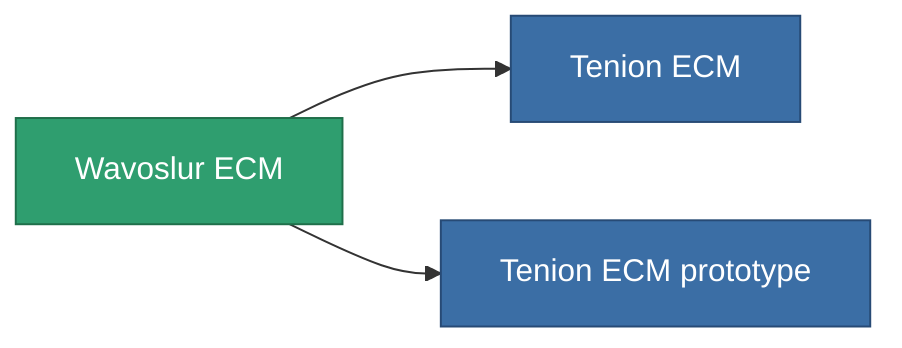

<!-- Generated by tools/generate from the live database (source: entitydefaults definition 790, aggregatevalues via aggregatefields).
     Do not edit by hand; regenerate instead. -->

# Wavoslur ECM

|  |  |
|---|---|
| Definition | `def_named2_sensor_jammer` |
| Tier | T3 |
| Health | 100 |
| Volume | 0.5 |
| Mass | 150 |
| Category | Modules / Sensors & scanning |
| Tier line | [Standard ECM](/content/items/standard-sensor-jammer/) (T1) → [Occyt-OEW ECM](/content/items/named1-sensor-jammer/) (T2) → **Wavoslur ECM** (T3) → [Tenion ECM](/content/items/named3-sensor-jammer/) (T4) |

## Stats

| Field | Value |
|---|---|
| core_usage | 75 |
| cpu_usage | 57 |
| cycle_time | 10k |
| ecm_strength | 32 |
| falloff | 0 |
| optimal_range | 32 |
| powergrid_usage | 26 |

<!-- production:generated -->
## Production

**Produced from 10 components, research level 5** — assemble the components to build it (see [Recipes](/content/recipes/) for the full list):

<svg class="prod-card-icon" aria-hidden="true"><use href="#mi-grid"/></svg><a class="prod-card-name" href="/content/items/chollonin/">Chollonin</a>

required: <b>100</b>

<svg class="prod-card-icon" aria-hidden="true"><use href="#mi-grid"/></svg><a class="prod-card-name" href="/content/items/espitium/">Espitium</a>

required: <b>100</b>

<svg class="prod-card-icon" aria-hidden="true"><use href="#mi-grid"/></svg><a class="prod-card-name" href="/content/items/hydrobenol/">Hydrobenol</a>

required: <b>50</b>

<svg class="prod-card-icon" aria-hidden="true"><use href="#mi-grid"/></svg><a class="prod-card-name" href="/content/items/named1-sensor-jammer/">Occyt-OEW ECM</a>

required: <b>1</b>

<svg class="prod-card-icon" aria-hidden="true"><use href="#mi-grid"/></svg><a class="prod-card-name" href="/content/items/polynitrocol/">Polynitrocol</a>

required: <b>50</b>

<svg class="prod-card-icon" aria-hidden="true"><use href="#mi-crystal"/></svg><a class="prod-card-name" href="/content/items/robotshard-common-advanced/">Functional common fragment</a>

required: <b>10</b>

<svg class="prod-card-icon" aria-hidden="true"><use href="#mi-crystal"/></svg><a class="prod-card-name" href="/content/items/robotshard-common-basic/">Damaged common fragment</a>

required: <b>10</b>

<svg class="prod-card-icon" aria-hidden="true"><use href="#mi-crystal"/></svg><a class="prod-card-name" href="/content/items/robotshard-nuimqol-advanced/">Functional nuimqol fragment</a>

required: <b>10</b>

<svg class="prod-card-icon" aria-hidden="true"><use href="#mi-crystal"/></svg><a class="prod-card-name" href="/content/items/robotshard-nuimqol-basic/">Damaged nuimqol fragment</a>

required: <b>10</b>

<svg class="prod-card-icon" aria-hidden="true"><use href="#mi-grid"/></svg><a class="prod-card-name" href="/content/items/titanium/">Titanium</a>

required: <b>50</b>

## Used in production

**Component of 2 items** — everything that uses it in production:

