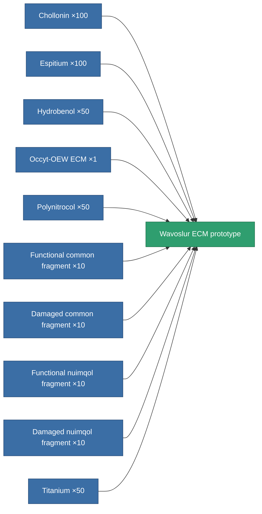

<!-- Generated by tools/generate from the live database (source: entitydefaults definition 2259, aggregatevalues via aggregatefields).
     Do not edit by hand; regenerate instead. -->

# Wavoslur ECM prototype

|  |  |
|---|---|
| Definition | `def_named2_sensor_jammer_pr` |
| Tier | T3 (prototype) |
| Health | 100 |
| Volume | 0.5 |
| Mass | 112.5 |
| Category | Modules / Sensors & scanning |
| Tier line | [Standard ECM](/content/items/standard-sensor-jammer/) (T1) → [Occyt-OEW ECM](/content/items/named1-sensor-jammer/) (T2) → [Wavoslur ECM](/content/items/named2-sensor-jammer/) (T3) → **Wavoslur ECM prototype** (T3) → [Tenion ECM](/content/items/named3-sensor-jammer/) (T4) |

## Stats

| Field | Value |
|---|---|
| core_usage | 67 |
| cpu_usage | 54 |
| cycle_time | 10k |
| ecm_strength | 32 |
| falloff | 0 |
| optimal_range | 32 |
| powergrid_usage | 25 |

<!-- production:generated -->
## Production

**Produced from 10 components, research level 5** — assemble the components to build it (see [Recipes](/content/recipes/) for the full list):

[All items](/content/items/)
