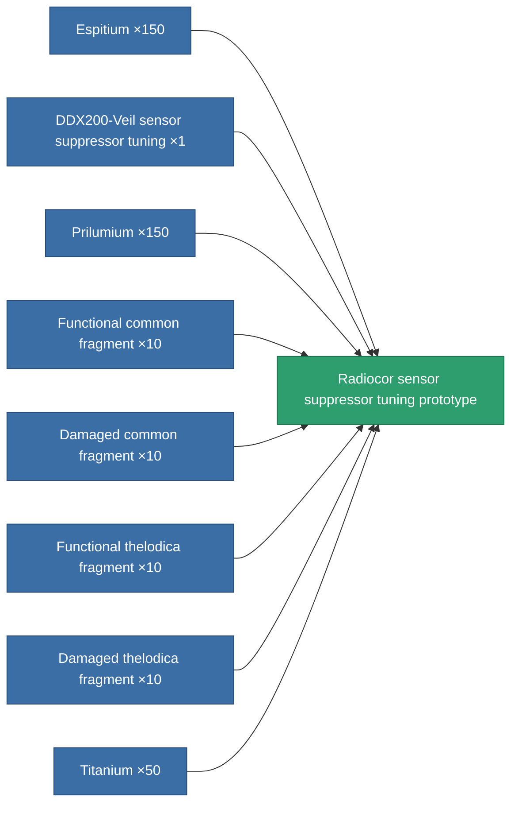

<!-- Generated by tools/generate from the live database (source: entitydefaults definition 5107, aggregatevalues via aggregatefields).
     Do not edit by hand; regenerate instead. -->

# Radiocor sensor suppressor tuning prototype

|  |  |
|---|---|
| Definition | `def_named2_sensor_supressor_booster_pr` |
| Tier | 3 |
| Health | 100 |
| Volume | 0.5 |
| Mass | 150 |
| Category | Modules / Sensors & scanning |

## Stats

| Field | Value |
|---|---|
| core_usage_sensor_dampener_modifier | 1.1 |
| cpu_usage | 55 |
| effect_enhancer_sensor_dampener_locking_range_modifier | 0.925 |
| effect_enhancer_sensor_dampener_locking_time_modifier | 1.165 |
| powergrid_usage | 20 |

<!-- production:generated -->
## Production

**Produced from 8 components, research level 7** — assemble the components to build it (see [Recipes](/content/recipes/) for the full list):

[All items](/content/items/)
