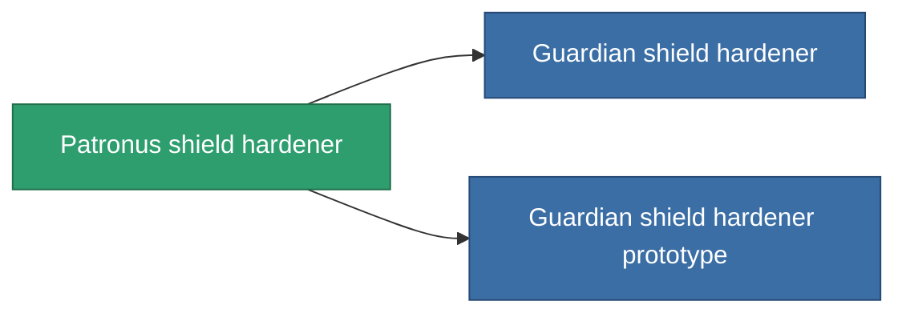

<!-- Generated by tools/generate from the live database (source: entitydefaults definition 733, aggregatevalues via aggregatefields).
     Do not edit by hand; regenerate instead. -->

# Patronus shield hardener

|  |  |
|---|---|
| Definition | `def_named2_shield_hardener` |
| Tier | 3 |
| Health | 100 |
| Volume | 0.5 |
| Mass | 300 |
| Category | Modules / Shield |
| Note | ettol a modultol tud jobban mudkodni a pajzs = kevesebb lesz a core csokkenes |

## Stats

| Field | Value |
|---|---|
| cpu_usage | 50 |
| powergrid_usage | 20 |
| shield_absorbtion_modifier | 1.25 |

<!-- production:generated -->
## Production

**Component of 2 items** — everything that uses it in production:

[All items](/content/items/)
