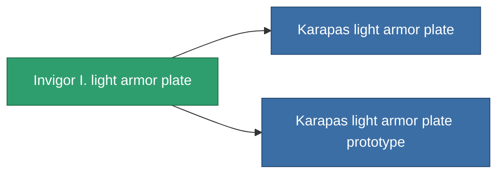

<!-- Generated by tools/generate from the live database (source: entitydefaults definition 685, aggregatevalues via aggregatefields).
     Do not edit by hand; regenerate instead. -->

# Invigor I. light armor plate

|  |  |
|---|---|
| Definition | `def_named2_small_armor_plate` |
| Tier | T3 |
| Health | 100 |
| Volume | 1 |
| Mass | 450 |
| Category | Modules / Armor |
| Tier line | [Standard light armor plate](/content/items/standard-small-armor-plate/) (T1) → [Wobost-Titangrip light armor plate](/content/items/named1-small-armor-plate/) (T2) → **Invigor I. light armor plate** (T3) → [Karapas light armor plate](/content/items/named3-small-armor-plate/) (T4) |

## Stats

| Field | Value |
|---|---|
| armor_max | 480 |
| cpu_usage | 1 |
| massiveness | 0.11 |
| powergrid_usage | 15 |
| signature_radius | 0.35 |

<!-- production:generated -->
## Production

**Produced from 6 components, research level 3** — assemble the components to build it (see [Recipes](/content/recipes/) for the full list):

<svg class="prod-card-icon" aria-hidden="true"><use href="#mi-grid"/></svg><a class="prod-card-name" href="/content/items/alligior/">Alligior</a>

required: <b>175</b>

<svg class="prod-card-icon" aria-hidden="true"><use href="#mi-tree"/></svg><a class="prod-card-name" href="/content/items/named1-small-armor-plate/">Wobost-Titangrip light armor plate</a>

required: <b>1</b>

<svg class="prod-card-icon" aria-hidden="true"><use href="#mi-grid"/></svg><a class="prod-card-name" href="/content/items/plasteosine/">Plasteosine</a>

required: <b>175</b>

<svg class="prod-card-icon" aria-hidden="true"><use href="#mi-crystal"/></svg><a class="prod-card-name" href="/content/items/robotshard-common-advanced/">Functional common fragment</a>

required: <b>20</b>

<svg class="prod-card-icon" aria-hidden="true"><use href="#mi-crystal"/></svg><a class="prod-card-name" href="/content/items/robotshard-common-basic/">Damaged common fragment</a>

required: <b>20</b>

<svg class="prod-card-icon" aria-hidden="true"><use href="#mi-grid"/></svg><a class="prod-card-name" href="/content/items/titanium/">Titanium</a>

required: <b>250</b>

## Used in production

**Component of 2 items** — everything that uses it in production:

