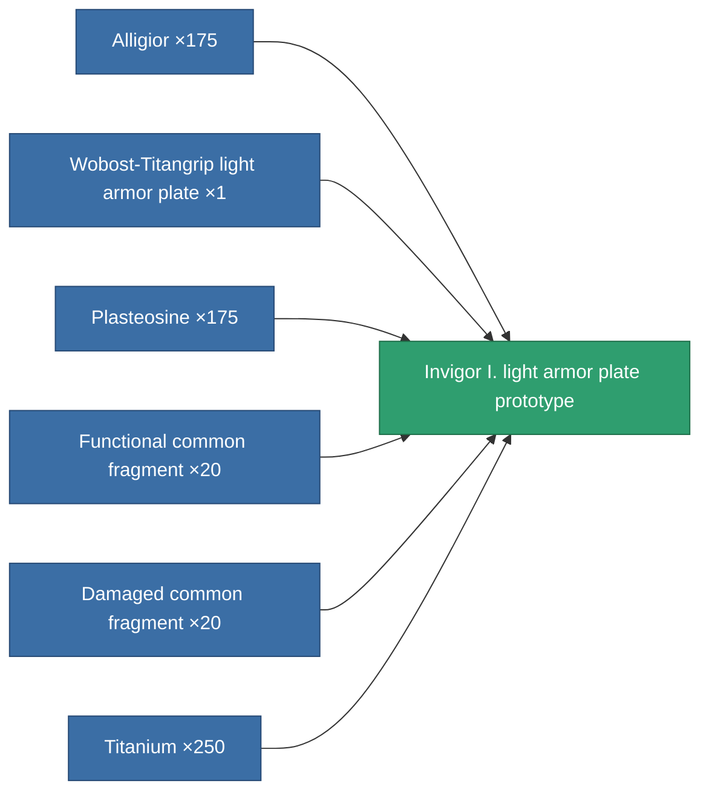

<!-- Generated by tools/generate from the live database (source: entitydefaults definition 2175, aggregatevalues via aggregatefields).
     Do not edit by hand; regenerate instead. -->

# Invigor I. light armor plate prototype

|  |  |
|---|---|
| Definition | `def_named2_small_armor_plate_pr` |
| Tier | 3 |
| Health | 100 |
| Volume | 1 |
| Mass | 337.5 |
| Category | Modules / Armor |

## Stats

| Field | Value |
|---|---|
| armor_max | 480 |
| cpu_usage | 1 |
| massiveness | 0.11 |
| powergrid_usage | 13 |
| signature_radius | 0.35 |

<!-- production:generated -->
## Production

**Produced from 6 components, research level 3** — assemble the components to build it (see [Recipes](/content/recipes/) for the full list):

[All items](/content/items/)
