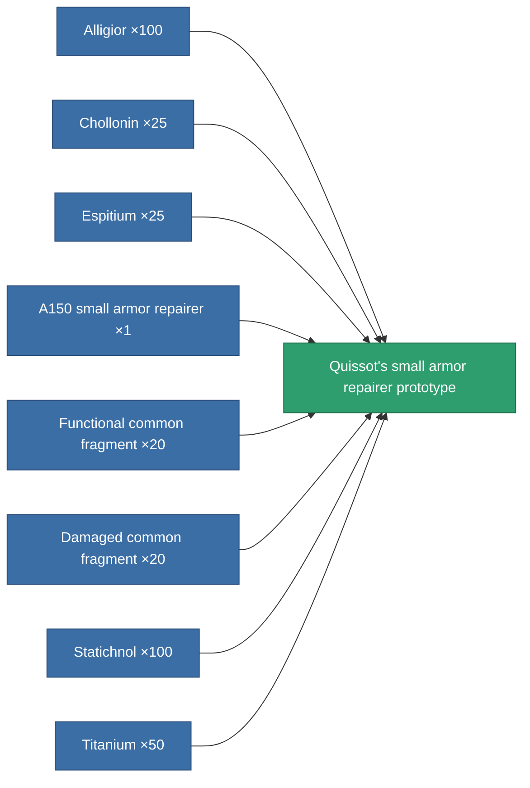

<!-- Generated by tools/generate from the live database (source: entitydefaults definition 2181, aggregatevalues via aggregatefields).
     Do not edit by hand; regenerate instead. -->

# Quissot's small armor repairer prototype

|  |  |
|---|---|
| Definition | `def_named2_small_armor_repairer_pr` |
| Tier | T3 (prototype) |
| Health | 100 |
| Volume | 1 |
| Mass | 187.5 |
| Category | Modules / Repair |
| Tier line | [Standard small armor repairer](/content/items/standard-small-armor-repairer/) (T1) → [A150 small armor repairer](/content/items/named1-small-armor-repairer/) (T2) → [Quissot's small armor repairer](/content/items/named2-small-armor-repairer/) (T3) → **Quissot's small armor repairer prototype** (T3) → [Microforge Aestolar small armor repairer](/content/items/named3-small-armor-repairer/) (T4) |

## Stats

| Field | Value |
|---|---|
| armor_repair_amount | 70 |
| core_usage | 63 |
| cpu_usage | 33 |
| cycle_time | 13.5k |
| powergrid_usage | 24 |

<!-- production:generated -->
## Production

**Produced from 8 components, research level 4** — assemble the components to build it (see [Recipes](/content/recipes/) for the full list):

[All items](/content/items/)
