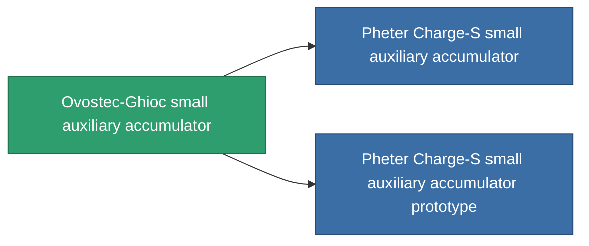

<!-- Generated by tools/generate from the live database (source: entitydefaults definition 814, aggregatevalues via aggregatefields).
     Do not edit by hand; regenerate instead. -->

# Ovostec-Ghioc small auxiliary accumulator

|  |  |
|---|---|
| Definition | `def_named2_small_core_battery` |
| Tier | 3 |
| Health | 100 |
| Volume | 0.5 |
| Mass | 100 |
| Category | Modules / Power |

## Stats

| Field | Value |
|---|---|
| core_max | 85 |
| cpu_usage | 37 |
| powergrid_usage | 15 |

<!-- production:generated -->
## Production

**Component of 2 items** — everything that uses it in production:

[All items](/content/items/)
