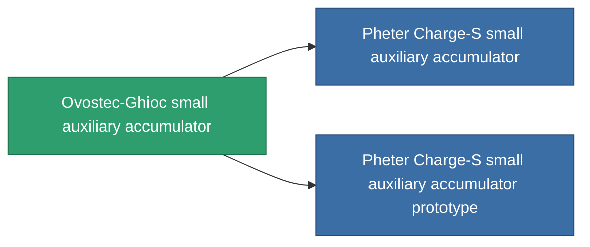

<!-- Generated by tools/generate from the live database (source: entitydefaults definition 814, aggregatevalues via aggregatefields).
     Do not edit by hand; regenerate instead. -->

# Ovostec-Ghioc small auxiliary accumulator

|  |  |
|---|---|
| Definition | `def_named2_small_core_battery` |
| Tier | T3 |
| Health | 100 |
| Volume | 0.5 |
| Mass | 100 |
| Category | Modules / Power |
| Tier line | [Standard small auxiliary accumulator](/content/items/standard-small-core-battery/) (T1) → [Co-Fuse small auxiliary accumulator](/content/items/named1-small-core-battery/) (T2) → **Ovostec-Ghioc small auxiliary accumulator** (T3) → [Pheter Charge-S small auxiliary accumulator](/content/items/named3-small-core-battery/) (T4) |

## Stats

| Field | Value |
|---|---|
| core_max | 85 |
| cpu_usage | 37 |
| powergrid_usage | 15 |

<!-- production:generated -->
## Production

**Produced from 6 components, research level 5** — assemble the components to build it (see [Recipes](/content/recipes/) for the full list):

<svg class="prod-card-icon" aria-hidden="true"><use href="#mi-grid"/></svg><a class="prod-card-name" href="/content/items/axicol/">Cryoperine</a>

required: <b>100</b>

<svg class="prod-card-icon" aria-hidden="true"><use href="#mi-grid"/></svg><a class="prod-card-name" href="/content/items/espitium/">Espitium</a>

required: <b>100</b>

<svg class="prod-card-icon" aria-hidden="true"><use href="#mi-grid"/></svg><a class="prod-card-name" href="/content/items/named1-small-core-battery/">Co-Fuse small auxiliary accumulator</a>

required: <b>1</b>

<svg class="prod-card-icon" aria-hidden="true"><use href="#mi-crystal"/></svg><a class="prod-card-name" href="/content/items/robotshard-common-advanced/">Functional common fragment</a>

required: <b>20</b>

<svg class="prod-card-icon" aria-hidden="true"><use href="#mi-crystal"/></svg><a class="prod-card-name" href="/content/items/robotshard-common-basic/">Damaged common fragment</a>

required: <b>20</b>

<svg class="prod-card-icon" aria-hidden="true"><use href="#mi-grid"/></svg><a class="prod-card-name" href="/content/items/titanium/">Titanium</a>

required: <b>100</b>

## Used in production

**Component of 2 items** — everything that uses it in production:

