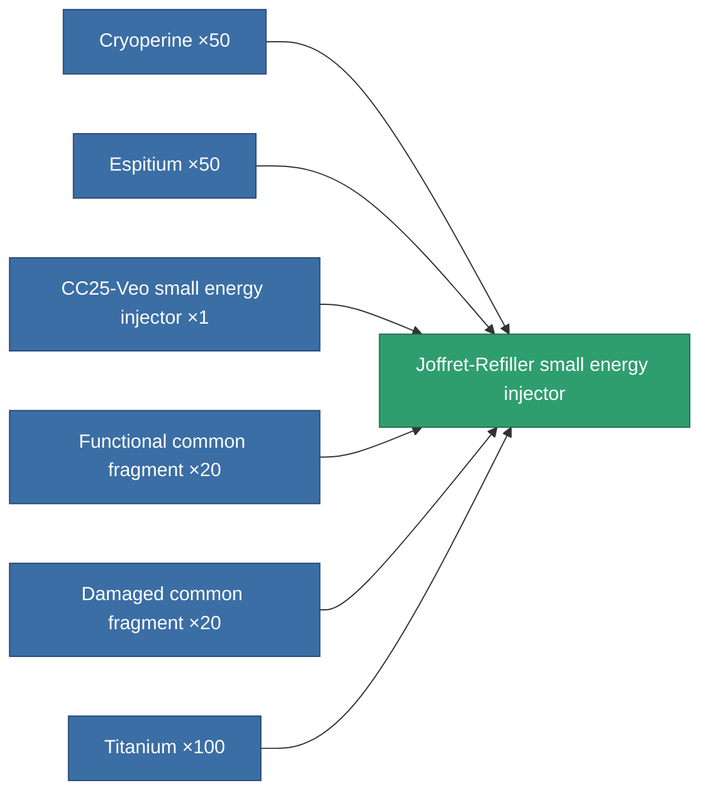
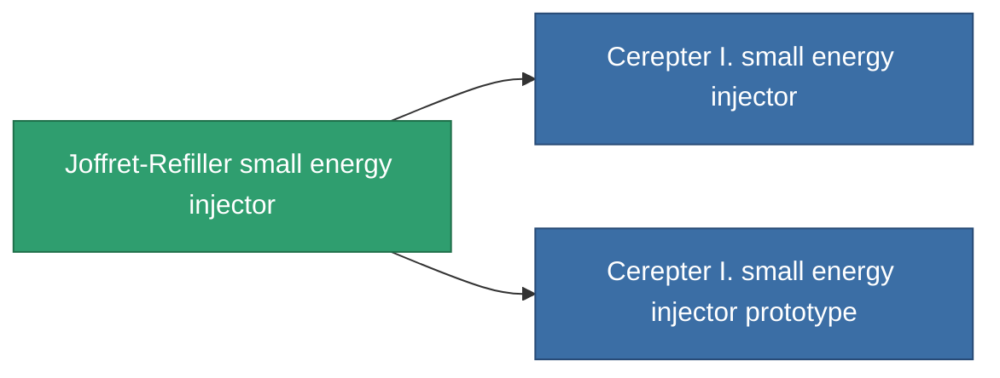

<!-- Generated by tools/generate from the live database (source: entitydefaults definition 823, aggregatevalues via aggregatefields).
     Do not edit by hand; regenerate instead. -->

# Joffret-Refiller small energy injector

|  |  |
|---|---|
| Definition | `def_named2_small_core_booster` |
| Tier | T3 |
| Health | 100 |
| Volume | 0.5 |
| Mass | 100 |
| Category | Modules / Enhancements |
| Tier line | [Standard small energy injector](/content/items/standard-small-core-booster/) (T1) → [CC25-Veo small energy injector](/content/items/named1-small-core-booster/) (T2) → **Joffret-Refiller small energy injector** (T3) → [Cerepter I. small energy injector](/content/items/named3-small-core-booster/) (T4) |

## Stats

| Field | Value |
|---|---|
| core_usage | 0 |
| cpu_usage | 18 |
| cycle_time | 18k |
| powergrid_usage | 55 |

<!-- production:generated -->
## Production

**Produced from 6 components, research level 4** — assemble the components to build it (see [Recipes](/content/recipes/) for the full list):

## Used in production

**Component of 2 items** — everything that uses it in production:

[All items](/content/items/)
