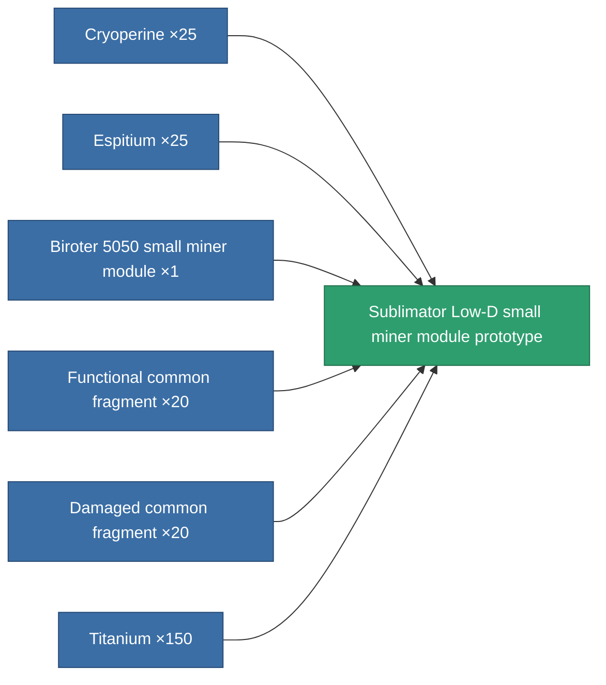

<!-- Generated by tools/generate from the live database (source: entitydefaults definition 2268, aggregatevalues via aggregatefields).
     Do not edit by hand; regenerate instead. -->

# Sublimator Low-D small miner module prototype

|  |  |
|---|---|
| Definition | `def_named2_small_driller_pr` |
| Tier | T3 (prototype) |
| Health | 100 |
| Volume | 1 |
| Mass | 300 |
| Category | Modules / Enhancements |
| Tier line | [Standard small miner module](/content/items/standard-small-driller/) (T1) → [Biroter 5050 small miner module](/content/items/named1-small-driller/) (T2) → [Sublimator Low-D small miner module](/content/items/named2-small-driller/) (T3) → **Sublimator Low-D small miner module prototype** (T3) → [Scraper-990 small miner module](/content/items/named3-small-driller/) (T4) |

## Stats

| Field | Value |
|---|---|
| core_usage | 17 |
| cpu_usage | 40 |
| cycle_time | 14k |
| optimal_range | 3 |
| powergrid_usage | 30 |

<!-- production:generated -->
## Production

**Produced from 6 components, research level 3** — assemble the components to build it (see [Recipes](/content/recipes/) for the full list):

[All items](/content/items/)
