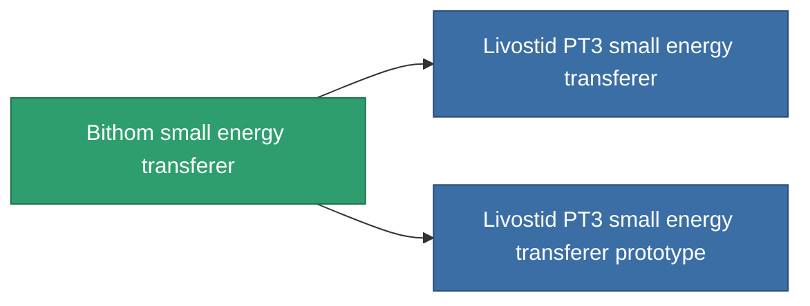

<!-- Generated by tools/generate from the live database (source: entitydefaults definition 736, aggregatevalues via aggregatefields).
     Do not edit by hand; regenerate instead. -->

# Bithom small energy transferer

|  |  |
|---|---|
| Definition | `def_named2_small_energy_transfer` |
| Tier | T3 |
| Health | 100 |
| Volume | 0.5 |
| Mass | 100 |
| Category | Modules / Enhancements |
| Tier line | [Standard small energy transferer](/content/items/standard-small-energy-transfer/) (T1) → [Uysta small energy transferer](/content/items/named1-small-energy-transfer/) (T2) → **Bithom small energy transferer** (T3) → [Livostid PT3 small energy transferer](/content/items/named3-small-energy-transfer/) (T4) |
| Note | range = optimal_range * 	energy_transferers_optimal_range_modifier    cel core += energy_transfer_amount  sajat core -= energy_transfer_amount - 10% |

## Stats

| Field | Value |
|---|---|
| core_usage | 5 |
| cpu_usage | 37 |
| cycle_time | 10k |
| energy_transfer_amount | 42 |
| falloff | 0 |
| optimal_range | 15 |
| powergrid_usage | 32 |

<!-- production:generated -->
## Production

**Produced from 6 components, research level 4** — assemble the components to build it (see [Recipes](/content/recipes/) for the full list):

<svg class="prod-card-icon" aria-hidden="true"><use href="#mi-grid"/></svg><a class="prod-card-name" href="/content/items/axicol/">Cryoperine</a>

required: <b>125</b>

<svg class="prod-card-icon" aria-hidden="true"><use href="#mi-grid"/></svg><a class="prod-card-name" href="/content/items/espitium/">Espitium</a>

required: <b>125</b>

<svg class="prod-card-icon" aria-hidden="true"><use href="#mi-grid"/></svg><a class="prod-card-name" href="/content/items/named1-small-energy-transfer/">Uysta small energy transferer</a>

required: <b>1</b>

<svg class="prod-card-icon" aria-hidden="true"><use href="#mi-crystal"/></svg><a class="prod-card-name" href="/content/items/robotshard-common-advanced/">Functional common fragment</a>

required: <b>20</b>

<svg class="prod-card-icon" aria-hidden="true"><use href="#mi-crystal"/></svg><a class="prod-card-name" href="/content/items/robotshard-common-basic/">Damaged common fragment</a>

required: <b>20</b>

<svg class="prod-card-icon" aria-hidden="true"><use href="#mi-grid"/></svg><a class="prod-card-name" href="/content/items/titanium/">Titanium</a>

required: <b>100</b>

## Used in production

**Component of 2 items** — everything that uses it in production:

