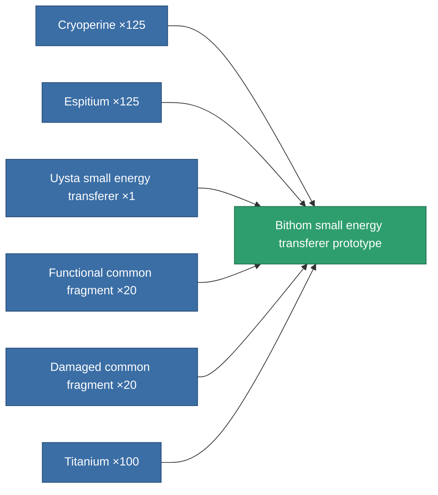

<!-- Generated by tools/generate from the live database (source: entitydefaults definition 2214, aggregatevalues via aggregatefields).
     Do not edit by hand; regenerate instead. -->

# Bithom small energy transferer prototype

|  |  |
|---|---|
| Definition | `def_named2_small_energy_transfer_pr` |
| Tier | T3 (prototype) |
| Health | 100 |
| Volume | 0.5 |
| Mass | 75 |
| Category | Modules / Enhancements |
| Tier line | [Standard small energy transferer](/content/items/standard-small-energy-transfer/) (T1) → [Uysta small energy transferer](/content/items/named1-small-energy-transfer/) (T2) → [Bithom small energy transferer](/content/items/named2-small-energy-transfer/) (T3) → **Bithom small energy transferer prototype** (T3) → [Livostid PT3 small energy transferer](/content/items/named3-small-energy-transfer/) (T4) |

## Stats

| Field | Value |
|---|---|
| core_usage | 5 |
| cpu_usage | 35 |
| cycle_time | 10k |
| energy_transfer_amount | 42 |
| falloff | 0 |
| optimal_range | 15 |
| powergrid_usage | 30 |

<!-- production:generated -->
## Production

**Produced from 6 components, research level 4** — assemble the components to build it (see [Recipes](/content/recipes/) for the full list):

[All items](/content/items/)
