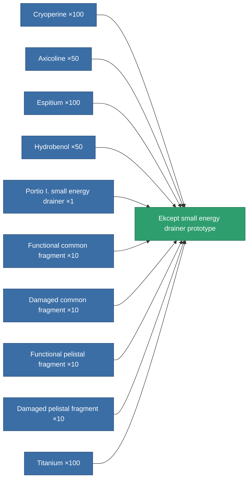

<!-- Generated by tools/generate from the live database (source: entitydefaults definition 2220, aggregatevalues via aggregatefields).
     Do not edit by hand; regenerate instead. -->

# Ekcept small energy drainer prototype

|  |  |
|---|---|
| Definition | `def_named2_small_energy_vampire_pr` |
| Tier | 3 |
| Health | 100 |
| Volume | 0.5 |
| Mass | 75 |
| Category | Modules / Shield |

## Stats

| Field | Value |
|---|---|
| core_usage | 5 |
| cpu_usage | 45 |
| cycle_time | 8k |
| energy_dispersion | 4 |
| energy_vampired_amount | 22 |
| falloff | 0 |
| optimal_range | 14 |
| powergrid_usage | 35 |

<!-- production:generated -->
## Production

**Produced from 10 components, research level 4** — assemble the components to build it (see [Recipes](/content/recipes/) for the full list):

[All items](/content/items/)
