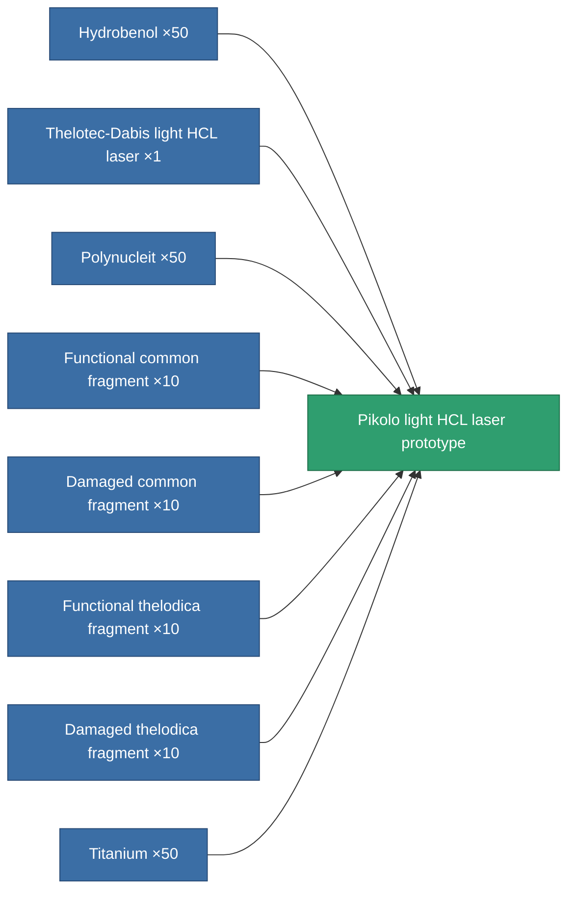

<!-- Generated by tools/generate from the live database (source: entitydefaults definition 2295, aggregatevalues via aggregatefields).
     Do not edit by hand; regenerate instead. -->

# Pikolo light HCL laser prototype

|  |  |
|---|---|
| Definition | `def_named2_small_laser_pr` |
| Tier | T3 (prototype) |
| Health | 100 |
| Volume | 0.5 |
| Mass | 250 |
| Category | Modules / Weapons |
| Tier line | [Standard light HCL laser](/content/items/standard-small-laser/) (T1) → [Thelotec-Dabis light HCL laser](/content/items/named1-small-laser/) (T2) → [Pikolo light HCL laser](/content/items/named2-small-laser/) (T3) → **Pikolo light HCL laser prototype** (T3) → [Thelotec-Stroyar light HCL laser](/content/items/named3-small-laser/) (T4) |

## Stats

| Field | Value |
|---|---|
| accuracy | 4 |
| core_usage | 3.2 |
| cpu_usage | 20 |
| cycle_time | 3k |
| damage_modifier | 0.9 |
| falloff | 10 |
| least_optimal | 4.5 |
| optimal_range | 16 |
| powergrid_usage | 40 |

<!-- production:generated -->
## Production

**Produced from 8 components, research level 4** — assemble the components to build it (see [Recipes](/content/recipes/) for the full list):

[All items](/content/items/)
