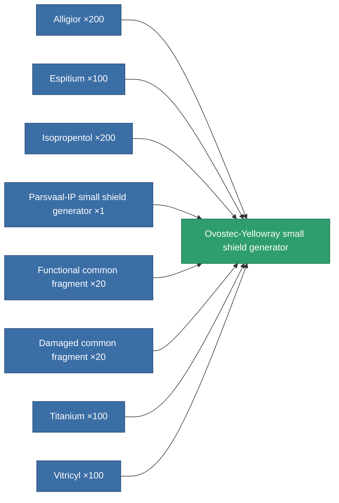
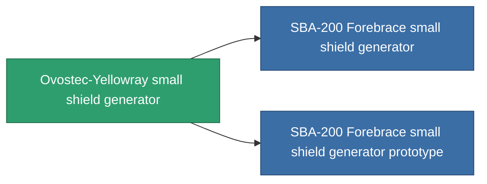

<!-- Generated by tools/generate from the live database (source: entitydefaults definition 724, aggregatevalues via aggregatefields).
     Do not edit by hand; regenerate instead. -->

# Ovostec-Yellowray small shield generator

|  |  |
|---|---|
| Definition | `def_named2_small_shield_generator` |
| Tier | T3 |
| Health | 100 |
| Volume | 0.3 |
| Mass | 210 |
| Category | Modules / Shield |
| Tier line | [Standard small shield generator](/content/items/standard-small-shield-generator/) (T1) → [Parsvaal-IP small shield generator](/content/items/named1-small-shield-generator/) (T2) → **Ovostec-Yellowray small shield generator** (T3) → [SBA-200 Forebrace small shield generator](/content/items/named3-small-shield-generator/) (T4) |
| Note | damage to core = shield_absorbtion * shield_absorbtion_modifier  amig ez a modul fut addig nincs damage, csak a core-bol von le.  |

## Stats

| Field | Value |
|---|---|
| core_usage | 1 |
| cpu_usage | 47 |
| cycle_time | 2.25k |
| powergrid_usage | 53 |
| shield_absorbtion | 2.2 |
| shield_radius | 4.5 |

<!-- production:generated -->
## Production

**Produced from 8 components, research level 4** — assemble the components to build it (see [Recipes](/content/recipes/) for the full list):

## Used in production

**Component of 2 items** — everything that uses it in production:

[All items](/content/items/)
