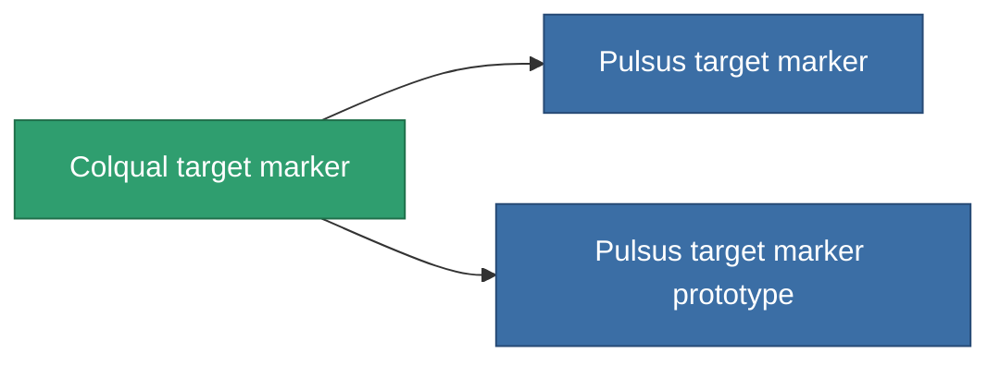

<!-- Generated by tools/generate from the live database (source: entitydefaults definition 2906, aggregatevalues via aggregatefields).
     Do not edit by hand; regenerate instead. -->

# Colqual target marker

|  |  |
|---|---|
| Definition | `def_named2_target_painter` |
| Tier | 3 |
| Health | 100 |
| Volume | 0.5 |
| Mass | 500 |
| Category | Modules / Enhancements |

## Stats

| Field | Value |
|---|---|
| core_usage | 130 |
| cpu_usage | 60 |
| cycle_time | 10k |
| effect_stealth_strength_modifier | -75 |
| optimal_range | 90 |
| powergrid_usage | 20 |

<!-- production:generated -->
## Production

**Component of 2 items** — everything that uses it in production:

[All items](/content/items/)
