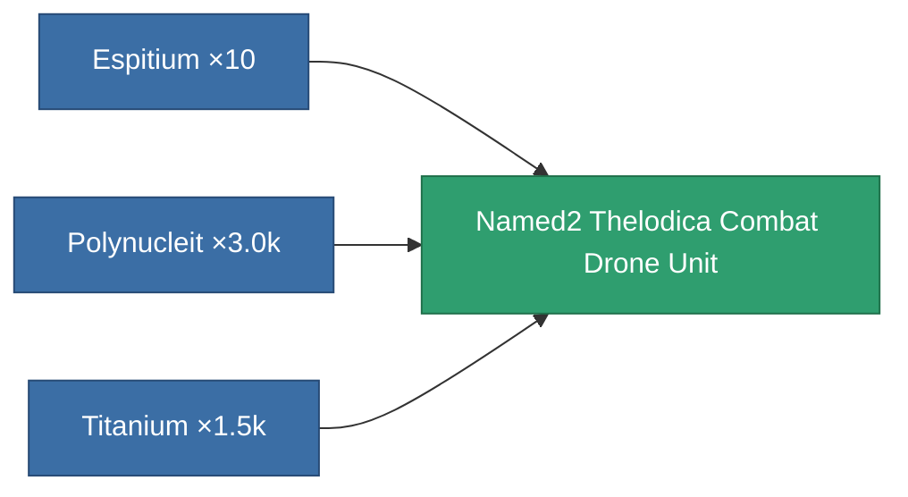

<!-- Generated by tools/generate from the live database (source: entitydefaults definition 8415, aggregatevalues via aggregatefields).
     Do not edit by hand; regenerate instead. -->

# Named2 Thelodica Combat Drone Unit

|  |  |
|---|---|
| Definition | `def_named2_thelodica_combat_drone_unit` |
| Tier | T3 |
| Health | 100 |
| Volume | 20 |
| Mass | 1 |
| Category | Special & other / Miscellaneous |
| Tier line | [Named1 Thelodica Combat Drone Unit](/content/items/named1-thelodica-combat-drone-unit/) (T2) → **Named2 Thelodica Combat Drone Unit** (T3) → [Named3 Thelodica Combat Drone Unit](/content/items/named3-thelodica-combat-drone-unit/) (T4) |

## Stats

| Field | Value |
|---|---|
| accuracy | 6.9 |
| armor_max | 4.76k |
| cycle_time | 3.57k |
| damage_thermal | 183.7776 |
| remote_control_bandwidth_usage | 5 |
| remote_control_lifetime | 300k |
| resist_chemical | 30 |
| resist_explosive | 10 |
| resist_kinetic | 150 |
| resist_thermal | 45 |
| signature_radius | 8.25 |

<!-- production:generated -->
## Production

**Produced from 3 components, research level 5** — assemble the components to build it (see [Recipes](/content/recipes/) for the full list):

[All items](/content/items/)
