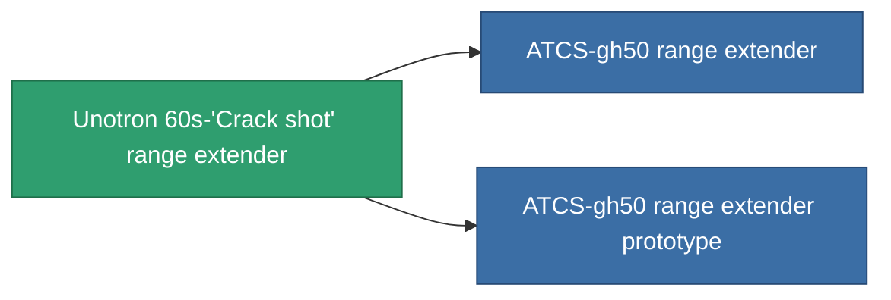

<!-- Generated by tools/generate from the live database (source: entitydefaults definition 937, aggregatevalues via aggregatefields).
     Do not edit by hand; regenerate instead. -->

# Unotron 60s-'Crack shot' range extender

|  |  |
|---|---|
| Definition | `def_named2_tracking_upgrade` |
| Tier | T3 |
| Health | 100 |
| Volume | 0.1 |
| Mass | 50 |
| Category | Modules / Enhancements |
| Tier line | [Standard range extender](/content/items/standard-tracking-upgrade/) (T1) → [Opaletrak range extender](/content/items/named1-tracking-upgrade/) (T2) → **Unotron 60s-'Crack shot' range extender** (T3) → [ATCS-gh50 range extender](/content/items/named3-tracking-upgrade/) (T4) |

## Stats

| Field | Value |
|---|---|
| cpu_usage | 38 |
| optimal_range_modifier | 1.125 |
| powergrid_usage | 110 |

<!-- production:generated -->
## Production

**Produced from 8 components, research level 5** — assemble the components to build it (see [Recipes](/content/recipes/) for the full list):

<svg class="prod-card-icon" aria-hidden="true"><use href="#mi-grid"/></svg><a class="prod-card-name" href="/content/items/axicol/">Cryoperine</a>

required: <b>150</b>

<svg class="prod-card-icon" aria-hidden="true"><use href="#mi-grid"/></svg><a class="prod-card-name" href="/content/items/axicoline/">Axicoline</a>

required: <b>75</b>

<svg class="prod-card-icon" aria-hidden="true"><use href="#mi-grid"/></svg><a class="prod-card-name" href="/content/items/espitium/">Espitium</a>

required: <b>150</b>

<svg class="prod-card-icon" aria-hidden="true"><use href="#mi-grid"/></svg><a class="prod-card-name" href="/content/items/hydrobenol/">Hydrobenol</a>

required: <b>75</b>

<svg class="prod-card-icon" aria-hidden="true"><use href="#mi-grid"/></svg><a class="prod-card-name" href="/content/items/named1-tracking-upgrade/">Opaletrak range extender</a>

required: <b>1</b>

<svg class="prod-card-icon" aria-hidden="true"><use href="#mi-crystal"/></svg><a class="prod-card-name" href="/content/items/robotshard-common-advanced/">Functional common fragment</a>

required: <b>20</b>

<svg class="prod-card-icon" aria-hidden="true"><use href="#mi-crystal"/></svg><a class="prod-card-name" href="/content/items/robotshard-common-basic/">Damaged common fragment</a>

required: <b>20</b>

<svg class="prod-card-icon" aria-hidden="true"><use href="#mi-grid"/></svg><a class="prod-card-name" href="/content/items/titanium/">Titanium</a>

required: <b>100</b>

## Used in production

**Component of 2 items** — everything that uses it in production:

