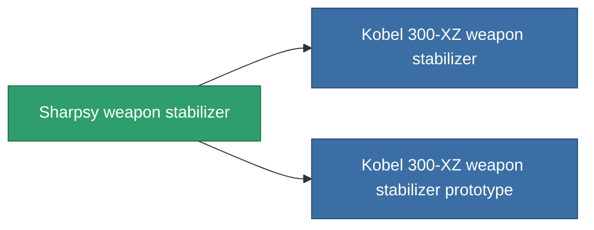

<!-- Generated by tools/generate from the live database (source: entitydefaults definition 3383, aggregatevalues via aggregatefields).
     Do not edit by hand; regenerate instead. -->

# Sharpsy weapon stabilizer

|  |  |
|---|---|
| Definition | `def_named2_weapon_stabilizer` |
| Tier | 3 |
| Health | 100 |
| Volume | 1 |
| Mass | 500 |
| Category | Modules / Weapons |

## Stats

| Field | Value |
|---|---|
| accuracy_modifier | 0.875 |
| cpu_usage | 37 |
| explosion_radius_modifier | 0.875 |
| massiveness | -0.05 |
| powergrid_usage | 21 |

<!-- production:generated -->
## Production

**Component of 2 items** — everything that uses it in production:

[All items](/content/items/)
