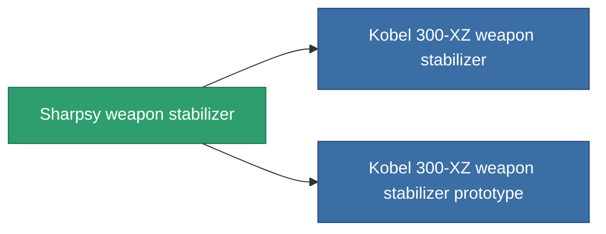

<!-- Generated by tools/generate from the live database (source: entitydefaults definition 3383, aggregatevalues via aggregatefields).
     Do not edit by hand; regenerate instead. -->

# Sharpsy weapon stabilizer

|  |  |
|---|---|
| Definition | `def_named2_weapon_stabilizer` |
| Tier | T3 |
| Health | 100 |
| Volume | 1 |
| Mass | 500 |
| Category | Modules / Weapons |
| Tier line | [Standard weapon stabilizer](/content/items/standard-weapon-stabilizer/) (T1) → [Kobel 450-TZ weapon stabilizer](/content/items/named1-weapon-stabilizer/) (T2) → **Sharpsy weapon stabilizer** (T3) → [Kobel 300-XZ weapon stabilizer](/content/items/named3-weapon-stabilizer/) (T4) |

## Stats

| Field | Value |
|---|---|
| accuracy_modifier | 0.875 |
| cpu_usage | 37 |
| explosion_radius_modifier | 0.875 |
| massiveness | -0.05 |
| powergrid_usage | 21 |

<!-- production:generated -->
## Production

**Produced from 8 components, research level 6** — assemble the components to build it (see [Recipes](/content/recipes/) for the full list):

<svg class="prod-card-icon" aria-hidden="true"><use href="#mi-grid"/></svg><a class="prod-card-name" href="/content/items/axicol/">Cryoperine</a>

required: <b>175</b>

<svg class="prod-card-icon" aria-hidden="true"><use href="#mi-grid"/></svg><a class="prod-card-name" href="/content/items/axicoline/">Axicoline</a>

required: <b>75</b>

<svg class="prod-card-icon" aria-hidden="true"><use href="#mi-grid"/></svg><a class="prod-card-name" href="/content/items/espitium/">Espitium</a>

required: <b>175</b>

<svg class="prod-card-icon" aria-hidden="true"><use href="#mi-grid"/></svg><a class="prod-card-name" href="/content/items/hydrobenol/">Hydrobenol</a>

required: <b>75</b>

<svg class="prod-card-icon" aria-hidden="true"><use href="#mi-robots"/></svg><a class="prod-card-name" href="/content/items/named1-weapon-stabilizer/">Kobel 450-TZ weapon stabilizer</a>

required: <b>1</b>

<svg class="prod-card-icon" aria-hidden="true"><use href="#mi-crystal"/></svg><a class="prod-card-name" href="/content/items/robotshard-common-advanced/">Functional common fragment</a>

required: <b>20</b>

<svg class="prod-card-icon" aria-hidden="true"><use href="#mi-crystal"/></svg><a class="prod-card-name" href="/content/items/robotshard-common-basic/">Damaged common fragment</a>

required: <b>20</b>

<svg class="prod-card-icon" aria-hidden="true"><use href="#mi-grid"/></svg><a class="prod-card-name" href="/content/items/titanium/">Titanium</a>

required: <b>150</b>

## Used in production

**Component of 2 items** — everything that uses it in production:

