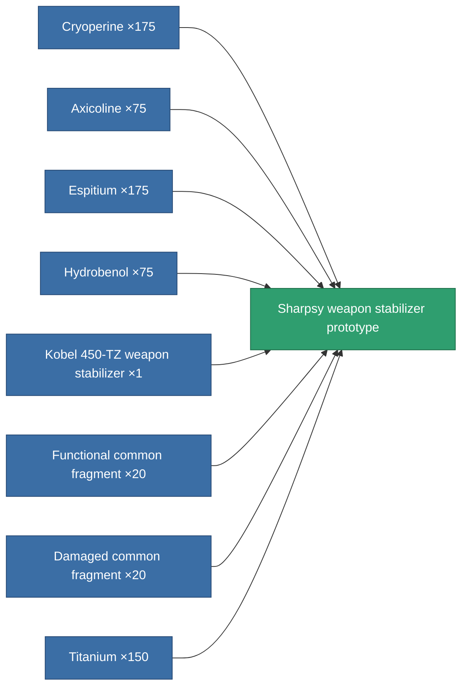

<!-- Generated by tools/generate from the live database (source: entitydefaults definition 3386, aggregatevalues via aggregatefields).
     Do not edit by hand; regenerate instead. -->

# Sharpsy weapon stabilizer prototype

|  |  |
|---|---|
| Definition | `def_named2_weapon_stabilizer_pr` |
| Tier | T3 (prototype) |
| Health | 100 |
| Volume | 1 |
| Mass | 375 |
| Category | Modules / Weapons |
| Tier line | [Standard weapon stabilizer](/content/items/standard-weapon-stabilizer/) (T1) → [Kobel 450-TZ weapon stabilizer](/content/items/named1-weapon-stabilizer/) (T2) → [Sharpsy weapon stabilizer](/content/items/named2-weapon-stabilizer/) (T3) → **Sharpsy weapon stabilizer prototype** (T3) → [Kobel 300-XZ weapon stabilizer](/content/items/named3-weapon-stabilizer/) (T4) |

## Stats

| Field | Value |
|---|---|
| accuracy_modifier | 0.875 |
| cpu_usage | 35 |
| explosion_radius_modifier | 0.875 |
| massiveness | -0.045 |
| powergrid_usage | 20 |

<!-- production:generated -->
## Production

**Produced from 8 components, research level 7** — assemble the components to build it (see [Recipes](/content/recipes/) for the full list):

[All items](/content/items/)
