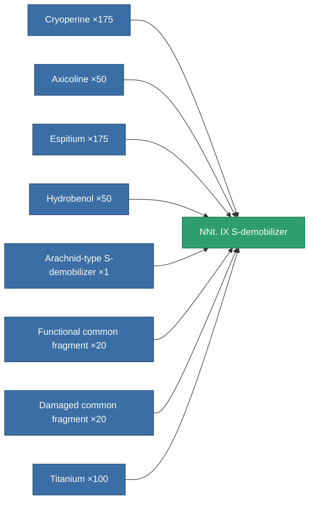
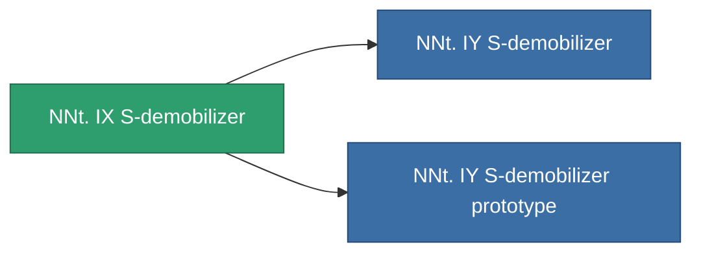

<!-- Generated by tools/generate from the live database (source: entitydefaults definition 787, aggregatevalues via aggregatefields).
     Do not edit by hand; regenerate instead. -->

# NNt. IX S-demobilizer

|  |  |
|---|---|
| Definition | `def_named2_webber` |
| Tier | T3 |
| Health | 100 |
| Volume | 0.5 |
| Mass | 100 |
| Category | Modules / Enhancements |
| Tier line | [Standard S-demobilizer](/content/items/standard-webber/) (T1) → [Arachnid-type S-demobilizer](/content/items/named1-webber/) (T2) → **NNt. IX S-demobilizer** (T3) → [NNt. IY S-demobilizer](/content/items/named3-webber/) (T4) |

## Stats

| Field | Value |
|---|---|
| core_usage | 18 |
| cpu_usage | 47 |
| cycle_time | 5k |
| effect_massivness_speed_max_modifier | 0.6 |
| falloff | 0 |
| optimal_range | 12 |
| powergrid_usage | 15 |

<!-- production:generated -->
## Production

**Produced from 8 components, research level 5** — assemble the components to build it (see [Recipes](/content/recipes/) for the full list):

## Used in production

**Component of 2 items** — everything that uses it in production:

[All items](/content/items/)
