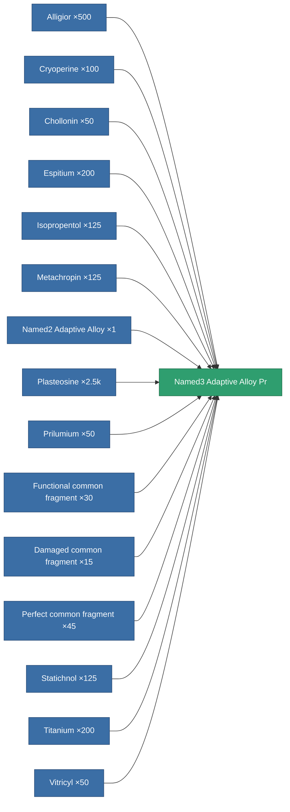

<!-- Generated by tools/generate from the live database (source: entitydefaults definition 8797, aggregatevalues via aggregatefields).
     Do not edit by hand; regenerate instead. -->

# Named3 Adaptive Alloy Pr

|  |  |
|---|---|
| Definition | `def_named3_adaptive_alloy_pr` |
| Tier | T4 (prototype) |
| Health | 100 |
| Volume | 1.5 |
| Mass | 371.4 |
| Category | Modules / Enhancements |
| Tier line | [Standard Adaptive Alloy](/content/items/standard-adaptive-alloy/) (T1) → [Named1 Adaptive Alloy](/content/items/named1-adaptive-alloy/) (T2) → [Named2 Adaptive Alloy](/content/items/named2-adaptive-alloy/) (T3) → [Named3 Adaptive Alloy](/content/items/named3-adaptive-alloy/) (T4) → **Named3 Adaptive Alloy Pr** (T4) |

## Stats

| Field | Value |
|---|---|
| adaptive_resist_points | 105 |
| cpu_usage | 41 |
| powergrid_usage | 13 |

<!-- production:generated -->
## Production

**Produced from 15 components, research level 6** — assemble the components to build it (see [Recipes](/content/recipes/) for the full list):

[All items](/content/items/)
