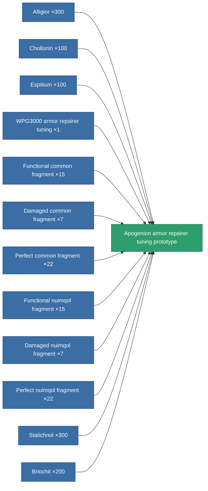

<!-- Generated by tools/generate from the live database (source: entitydefaults definition 2347, aggregatevalues via aggregatefields).
     Do not edit by hand; regenerate instead. -->

# Apogenion armor repairer tuning prototype

|  |  |
|---|---|
| Definition | `def_named3_armor_repairer_upgrade_pr` |
| Tier | 4 |
| Health | 100 |
| Volume | 0.5 |
| Mass | 300 |
| Category | Modules / Repair |

## Stats

| Field | Value |
|---|---|
| armor_repair_amount_modifier | 1.16 |
| armor_repair_cycle_time_modifier | 0.92 |
| cpu_usage | 38 |
| powergrid_usage | 29 |

<!-- production:generated -->
## Production

**Produced from 12 components, research level 6** — assemble the components to build it (see [Recipes](/content/recipes/) for the full list):

[All items](/content/items/)
