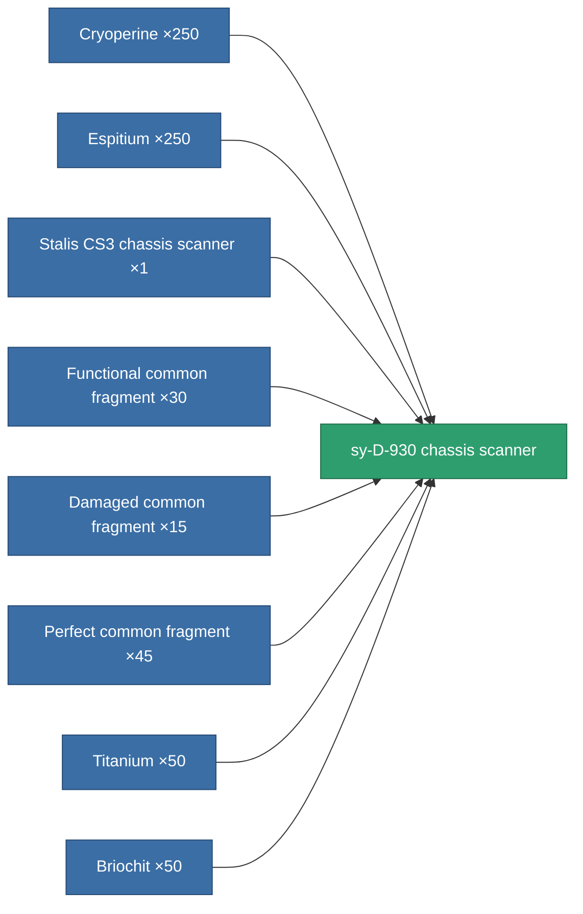

<!-- Generated by tools/generate from the live database (source: entitydefaults definition 779, aggregatevalues via aggregatefields).
     Do not edit by hand; regenerate instead. -->

# sy-D-930 chassis scanner

|  |  |
|---|---|
| Definition | `def_named3_chassis_scanner` |
| Tier | T4 |
| Health | 100 |
| Volume | 0.5 |
| Mass | 200 |
| Category | Modules / Sensors & scanning |
| Tier line | [Standard chassis scanner](/content/items/standard-chassis-scanner/) (T1) → [Distalfrisk-MDO2 chassis scanner](/content/items/named1-chassis-scanner/) (T2) → [Stalis CS3 chassis scanner](/content/items/named2-chassis-scanner/) (T3) → **sy-D-930 chassis scanner** (T4) |

## Stats

| Field | Value |
|---|---|
| core_usage | 25 |
| cpu_usage | 20 |
| cycle_time | 2.5k |
| falloff | 10 |
| optimal_range | 35 |
| powergrid_usage | 6 |

<!-- production:generated -->
## Production

**Produced from 8 components, research level 6** — assemble the components to build it (see [Recipes](/content/recipes/) for the full list):

[All items](/content/items/)
