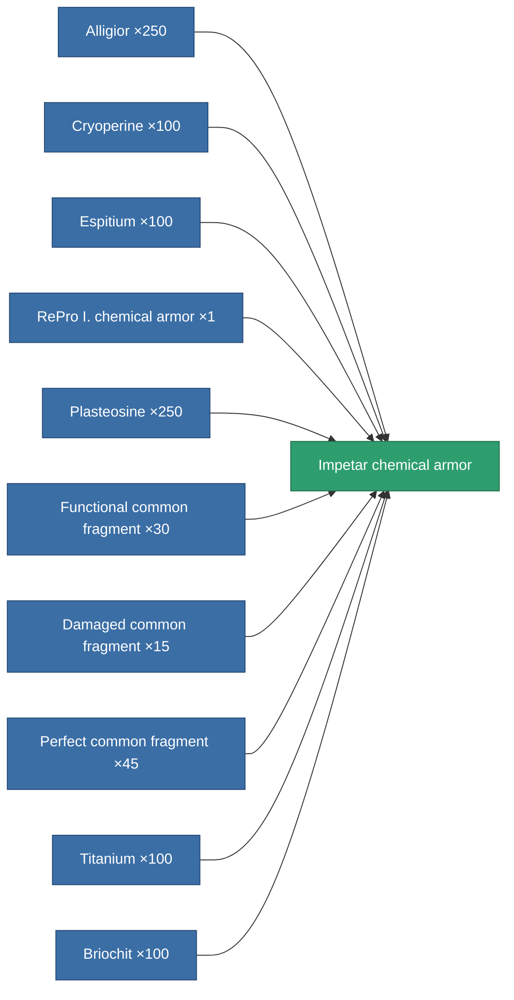

<!-- Generated by tools/generate from the live database (source: entitydefaults definition 720, aggregatevalues via aggregatefields).
     Do not edit by hand; regenerate instead. -->

# Impetar chemical armor

|  |  |
|---|---|
| Definition | `def_named3_chm_armor_hardener` |
| Tier | T4 |
| Health | 100 |
| Volume | 1 |
| Mass | 100 |
| Category | Modules / Armor |
| Tier line | [Standard chemical armor](/content/items/standard-chm-armor-hardener/) (T1) → [Delloy s2s chemical armor](/content/items/named1-chm-armor-hardener/) (T2) → [RePro I. chemical armor](/content/items/named2-chm-armor-hardener/) (T3) → **Impetar chemical armor** (T4) |

## Stats

| Field | Value |
|---|---|
| core_usage | 14 |
| cpu_usage | 27 |
| cycle_time | 10k |
| effect_resist_chemical | 125 |
| powergrid_usage | 6 |
| resist_chemical | 25 |

<!-- production:generated -->
## Production

**Produced from 10 components, research level 6** — assemble the components to build it (see [Recipes](/content/recipes/) for the full list):

[All items](/content/items/)
