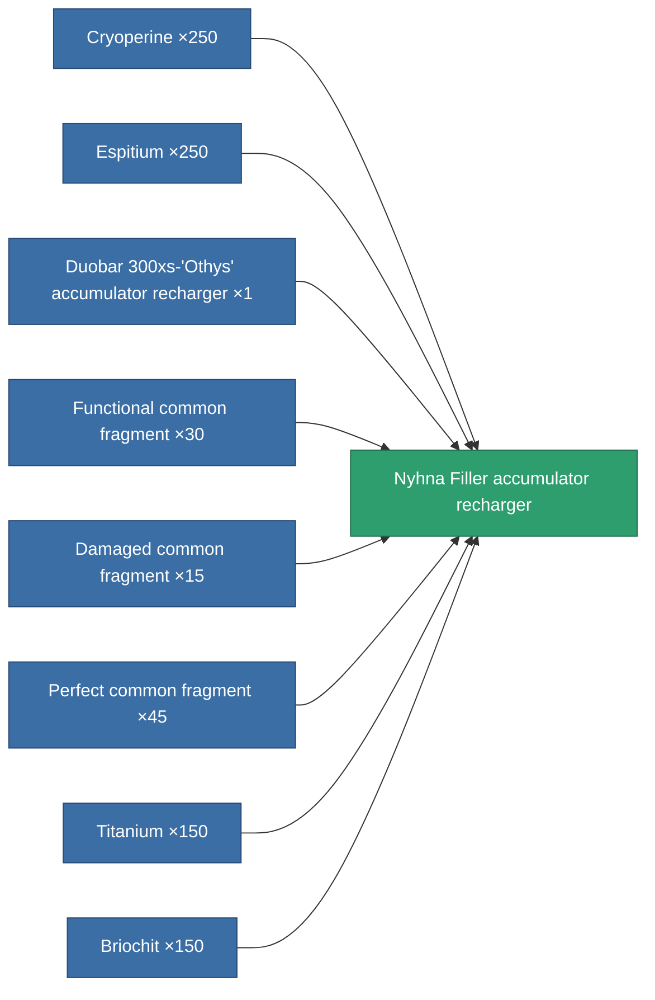

<!-- Generated by tools/generate from the live database (source: entitydefaults definition 764, aggregatevalues via aggregatefields).
     Do not edit by hand; regenerate instead. -->

# Nyhna Filler accumulator recharger

|  |  |
|---|---|
| Definition | `def_named3_core_recharger` |
| Tier | T4 |
| Health | 100 |
| Volume | 0.5 |
| Mass | 100 |
| Category | Modules / Power |
| Tier line | [Standard accumulator recharger](/content/items/standard-core-recharger/) (T1) → [Basis Ionostator accumulator recharger](/content/items/named1-core-recharger/) (T2) → [Duobar 300xs-'Othys' accumulator recharger](/content/items/named2-core-recharger/) (T3) → **Nyhna Filler accumulator recharger** (T4) |

## Stats

| Field | Value |
|---|---|
| core_recharge_time_modifier | 0.825 |
| cpu_usage | 29 |
| powergrid_usage | 2 |

<!-- production:generated -->
## Production

**Produced from 8 components, research level 6** — assemble the components to build it (see [Recipes](/content/recipes/) for the full list):

[All items](/content/items/)
