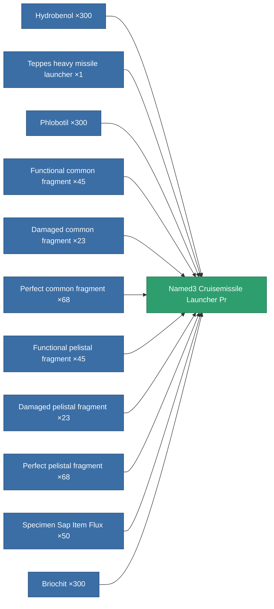

<!-- Generated by tools/generate from the live database (source: entitydefaults definition 5813, aggregatevalues via aggregatefields).
     Do not edit by hand; regenerate instead. -->

# Named3 Cruisemissile Launcher Pr

|  |  |
|---|---|
| Definition | `def_named3_cruisemissile_launcher_pr` |
| Tier | 4 |
| Health | 100 |
| Volume | 1.5 |
| Mass | 1100 |
| Category | Modules / Weapons |
| Note | large weapon module |

## Stats

| Field | Value |
|---|---|
| accuracy | 1 |
| core_usage | 15 |
| cpu_usage | 112.5 |
| cycle_time | 10.5k |
| damage_modifier | 1.5 |
| module_missile_range_modifier | 1.2 |
| powergrid_usage | 255 |

<!-- production:generated -->
## Production

**Produced from 11 components, research level 8** — assemble the components to build it (see [Recipes](/content/recipes/) for the full list):

[All items](/content/items/)
