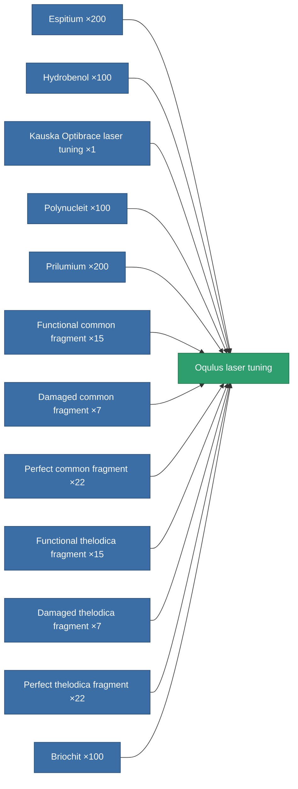

<!-- Generated by tools/generate from the live database (source: entitydefaults definition 932, aggregatevalues via aggregatefields).
     Do not edit by hand; regenerate instead. -->

# Oqulus laser tuning

|  |  |
|---|---|
| Definition | `def_named3_damage_mod_laser` |
| Tier | T4 |
| Health | 100 |
| Volume | 0.5 |
| Mass | 125 |
| Category | Modules / Weapons |
| Tier line | [Standard laser tuning](/content/items/standard-damage-mod-laser/) (T1) → [Reflexis II. laser tuning](/content/items/named1-damage-mod-laser/) (T2) → [Kauska Optibrace laser tuning](/content/items/named2-damage-mod-laser/) (T3) → **Oqulus laser tuning** (T4) |

## Stats

| Field | Value |
|---|---|
| cpu_usage | 21 |
| damage_laser_modifier | 0.25 |
| powergrid_usage | 13 |

<!-- production:generated -->
## Production

**Produced from 12 components, research level 6** — assemble the components to build it (see [Recipes](/content/recipes/) for the full list):

[All items](/content/items/)
