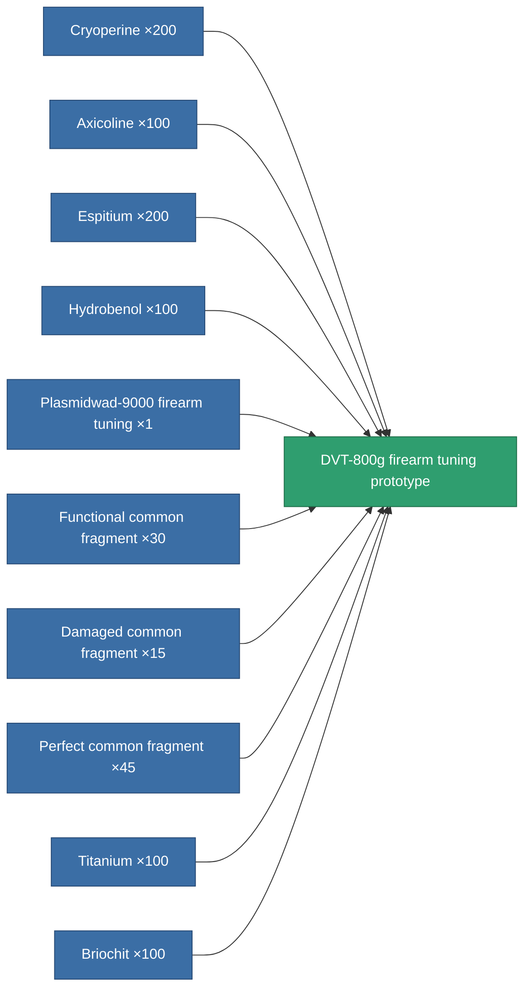

<!-- Generated by tools/generate from the live database (source: entitydefaults definition 2329, aggregatevalues via aggregatefields).
     Do not edit by hand; regenerate instead. -->

# DVT-800g firearm tuning prototype

|  |  |
|---|---|
| Definition | `def_named3_damage_mod_projectile_pr` |
| Tier | T4 (prototype) |
| Health | 100 |
| Volume | 0.5 |
| Mass | 100 |
| Category | Modules / Enhancements |
| Tier line | [Standard firearm tuning](/content/items/standard-damage-mod-projectile/) (T1) → [Diathel-Subperis firearm tuning](/content/items/named1-damage-mod-projectile/) (T2) → [Plasmidwad-9000 firearm tuning](/content/items/named2-damage-mod-projectile/) (T3) → [DVT-800g firearm tuning](/content/items/named3-damage-mod-projectile/) (T4) → **DVT-800g firearm tuning prototype** (T4) |

## Stats

| Field | Value |
|---|---|
| cpu_usage | 15 |
| damage_projectile_modifier | 0.25 |
| powergrid_usage | 5 |

<!-- production:generated -->
## Production

**Produced from 10 components, research level 6** — assemble the components to build it (see [Recipes](/content/recipes/) for the full list):

[All items](/content/items/)
