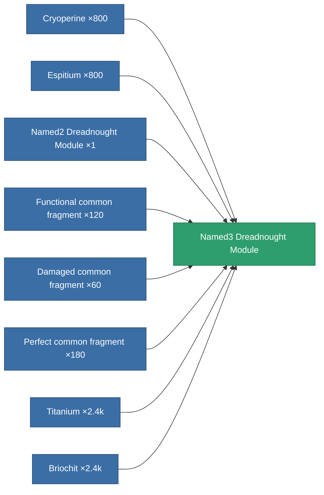

<!-- Generated by tools/generate from the live database (source: entitydefaults definition 8807, aggregatevalues via aggregatefields).
     Do not edit by hand; regenerate instead. -->

# Named3 Dreadnought Module

|  |  |
|---|---|
| Definition | `def_named3_dreadnought_module` |
| Tier | T4 |
| Health | 100 |
| Volume | 2.5 |
| Mass | 1500 |
| Category | Modules / Enhancements |
| Tier line | [Standard Dreadnought Module](/content/items/standard-dreadnought-module/) (T1) → [Named1 Dreadnought Module](/content/items/named1-dreadnought-module/) (T2) → [Named2 Dreadnought Module](/content/items/named2-dreadnought-module/) (T3) → **Named3 Dreadnought Module** (T4) |

## Stats

| Field | Value |
|---|---|
| core_usage | 195 |
| cpu_usage | 495 |
| cycle_time | 180k |
| effect_dreadnought_blob_emission_modifier | 1.8 |
| effect_dreadnought_detection_strength_modifier | 150 |
| effect_dreadnought_optimal_range_modifier | 2 |
| effect_dreadnought_stealth_strength_modifier | -20 |
| effect_dreadnought_weapon_cycle_time_modifier | 0.5 |
| effect_dreadnought_weapon_damage_modifier | 1.5 |
| powergrid_usage | 1.458k |

<!-- production:generated -->
## Production

**Produced from 8 components** — assemble the components to build it (see [Recipes](/content/recipes/) for the full list):

[All items](/content/items/)
