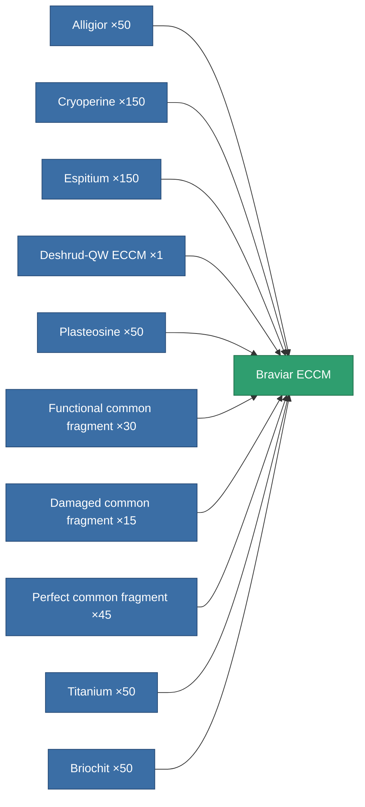

<!-- Generated by tools/generate from the live database (source: entitydefaults definition 797, aggregatevalues via aggregatefields).
     Do not edit by hand; regenerate instead. -->

# Braviar ECCM

|  |  |
|---|---|
| Definition | `def_named3_eccm` |
| Tier | T4 |
| Health | 100 |
| Volume | 0.5 |
| Mass | 100 |
| Category | Modules / Enhancements |
| Tier line | [Standard ECCM](/content/items/standard-eccm/) (T1) → [Wallex ECCM](/content/items/named1-eccm/) (T2) → [Deshrud-QW ECCM](/content/items/named2-eccm/) (T3) → **Braviar ECCM** (T4) |

## Stats

| Field | Value |
|---|---|
| cpu_usage | 27 |
| powergrid_usage | 17 |
| sensor_strength_modifier | 75 |

<!-- production:generated -->
## Production

**Produced from 10 components, research level 5** — assemble the components to build it (see [Recipes](/content/recipes/) for the full list):

## Used in production

**Component of 1 items** — everything that uses it in production:

[All items](/content/items/)
