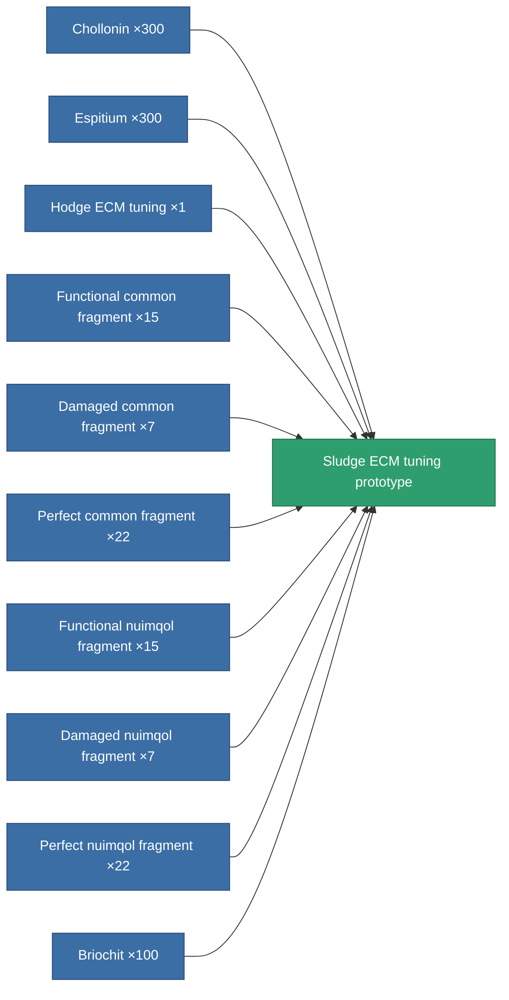

<!-- Generated by tools/generate from the live database (source: entitydefaults definition 5109, aggregatevalues via aggregatefields).
     Do not edit by hand; regenerate instead. -->

# Sludge ECM tuning prototype

|  |  |
|---|---|
| Definition | `def_named3_ecm_booster_pr` |
| Tier | 4 |
| Health | 100 |
| Volume | 0.5 |
| Mass | 165 |
| Category | Modules / Enhancements |

## Stats

| Field | Value |
|---|---|
| core_usage_sensor_jammer_modifier | 1.1 |
| cpu_usage | 71 |
| ecm_strength_modifier | 1.35 |
| powergrid_usage | 28 |

<!-- production:generated -->
## Production

**Produced from 10 components, research level 8** — assemble the components to build it (see [Recipes](/content/recipes/) for the full list):

[All items](/content/items/)
