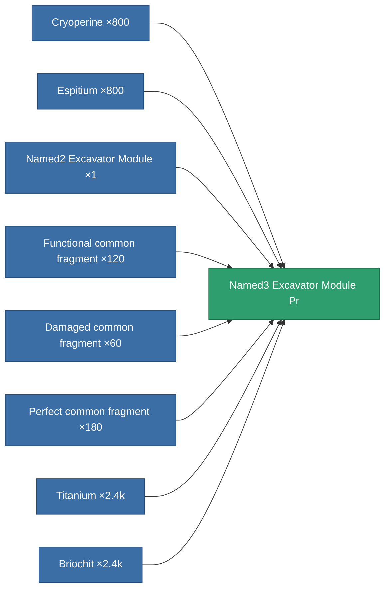

<!-- Generated by tools/generate from the live database (source: entitydefaults definition 8828, aggregatevalues via aggregatefields).
     Do not edit by hand; regenerate instead. -->

# Named3 Excavator Module Pr

|  |  |
|---|---|
| Definition | `def_named3_excavator_module_pr` |
| Tier | T4 (prototype) |
| Health | 100 |
| Volume | 2.5 |
| Mass | 1250 |
| Category | Modules / Harvesting |
| Tier line | [Standard Excavator Module](/content/items/standard-excavator-module/) (T1) → [Named1 Excavator Module](/content/items/named1-excavator-module/) (T2) → [Named2 Excavator Module](/content/items/named2-excavator-module/) (T3) → [Named3 Excavator Module](/content/items/named3-excavator-module/) (T4) → **Named3 Excavator Module Pr** (T4) |

## Stats

| Field | Value |
|---|---|
| core_usage | 252 |
| cpu_usage | 468 |
| cycle_time | 180k |
| effect_excavator_harvesting_amount_modifier | 1.5 |
| effect_excavator_mining_amount_modifier | 1.5 |
| effect_excavator_stealth_strength_modifier | -20 |
| powergrid_usage | 1.458k |

<!-- production:generated -->
## Production

**Produced from 8 components, research level 8** — assemble the components to build it (see [Recipes](/content/recipes/) for the full list):

[All items](/content/items/)
