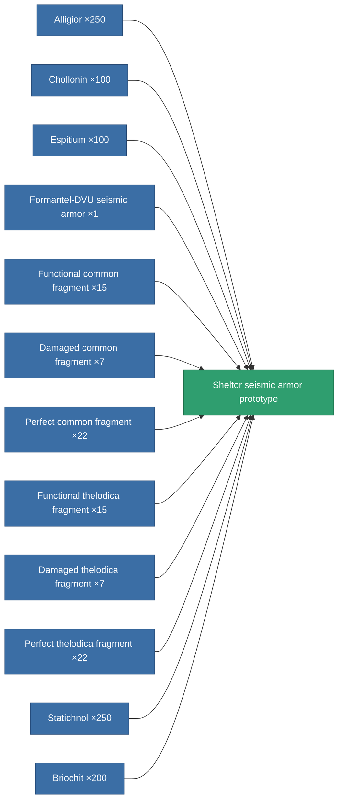

<!-- Generated by tools/generate from the live database (source: entitydefaults definition 2203, aggregatevalues via aggregatefields).
     Do not edit by hand; regenerate instead. -->

# Sheltor seismic armor prototype

|  |  |
|---|---|
| Definition | `def_named3_exp_armor_hardener_pr` |
| Tier | T4 (prototype) |
| Health | 100 |
| Volume | 1 |
| Mass | 75 |
| Category | Modules / Armor |
| Tier line | [Standard seismic armor](/content/items/standard-exp-armor-hardener/) (T1) → [Ballistris I. seismic armor](/content/items/named1-exp-armor-hardener/) (T2) → [Formantel-DVU seismic armor](/content/items/named2-exp-armor-hardener/) (T3) → [Sheltor seismic armor](/content/items/named3-exp-armor-hardener/) (T4) → **Sheltor seismic armor prototype** (T4) |

## Stats

| Field | Value |
|---|---|
| core_usage | 12 |
| cpu_usage | 26 |
| cycle_time | 10k |
| effect_resist_explosive | 125 |
| powergrid_usage | 6 |
| resist_explosive | 25 |

<!-- production:generated -->
## Production

**Produced from 12 components, research level 6** — assemble the components to build it (see [Recipes](/content/recipes/) for the full list):

[All items](/content/items/)
