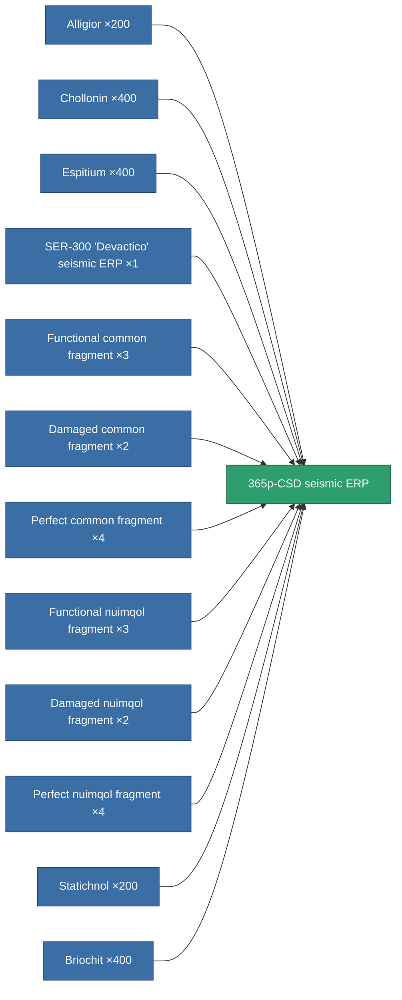

<!-- Generated by tools/generate from the live database (source: entitydefaults definition 3304, aggregatevalues via aggregatefields).
     Do not edit by hand; regenerate instead. -->

# 365p-CSD seismic ERP

|  |  |
|---|---|
| Definition | `def_named3_explosive_kers` |
| Tier | 4 |
| Health | 100 |
| Volume | 1 |
| Mass | 525 |
| Category | Modules / Enhancements |

## Stats

| Field | Value |
|---|---|
| chemical_damage_to_core_modifier | 0.3 |
| cpu_usage | 57 |
| explosive_damage_to_core_modifier | 0.7 |
| kinetic_damage_to_core_modifier | 0.15 |
| powergrid_usage | 20 |
| thermal_damage_to_core_modifier | 0.15 |

<!-- production:generated -->
## Production

**Produced from 12 components, research level 8** — assemble the components to build it (see [Recipes](/content/recipes/) for the full list):

[All items](/content/items/)
