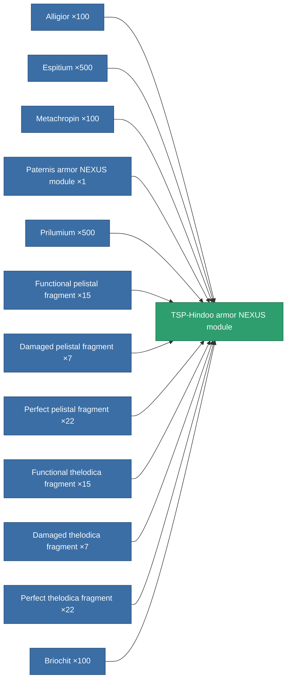

<!-- Generated by tools/generate from the live database (source: entitydefaults definition 2582, aggregatevalues via aggregatefields).
     Do not edit by hand; regenerate instead. -->

# TSP-Hindoo armor NEXUS module

|  |  |
|---|---|
| Definition | `def_named3_gang_assist_defense_module` |
| Tier | 4 |
| Health | 100 |
| Volume | 0.2 |
| Mass | 10 |
| Category | Modules / Enhancements |
| Note | armor hp 1% /ext lvl |

## Stats

| Field | Value |
|---|---|
| core_usage | 40 |
| cpu_usage | 95 |
| cycle_time | 10k |
| default_effect_range | 100 |
| effect_armor_max_modifier | 1.075 |
| powergrid_usage | 40 |

<!-- production:generated -->
## Production

**Produced from 12 components, research level 7** — assemble the components to build it (see [Recipes](/content/recipes/) for the full list):

[All items](/content/items/)
