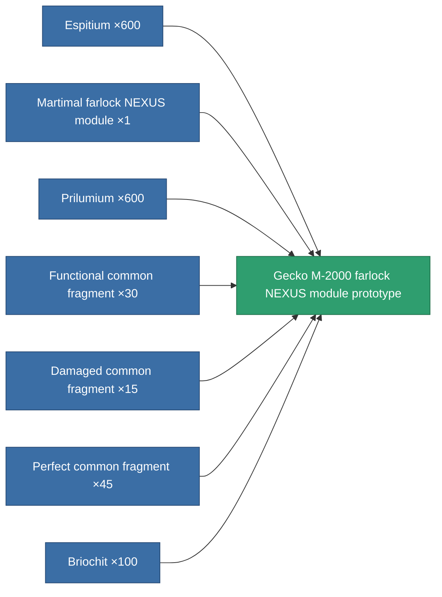

<!-- Generated by tools/generate from the live database (source: entitydefaults definition 2621, aggregatevalues via aggregatefields).
     Do not edit by hand; regenerate instead. -->

# Gecko M-2000 farlock NEXUS module prototype

|  |  |
|---|---|
| Definition | `def_named3_gang_assist_information_module_pr` |
| Tier | T4 (prototype) |
| Health | 100 |
| Volume | 0.2 |
| Mass | 7.5 |
| Category | Modules / Enhancements |
| Tier line | [Standard farlock NEXUS module](/content/items/standard-gang-assist-information-module/) (T1) → [Gecko D-1500 farlock NEXUS module](/content/items/named1-gang-assist-information-module/) (T2) → [Martimal farlock NEXUS module](/content/items/named2-gang-assist-information-module/) (T3) → [Gecko M-2000 farlock NEXUS module](/content/items/named3-gang-assist-information-module/) (T4) → **Gecko M-2000 farlock NEXUS module prototype** (T4) |

## Stats

| Field | Value |
|---|---|
| core_usage | 36 |
| cpu_usage | 90 |
| cycle_time | 10k |
| default_effect_range | 100 |
| effect_enhancer_aura_radius_modifier | 1.2 |
| effect_locking_range_modifier | 1.075 |
| powergrid_usage | 38 |

<!-- production:generated -->
## Production

**Produced from 7 components, research level 7** — assemble the components to build it (see [Recipes](/content/recipes/) for the full list):

[All items](/content/items/)
