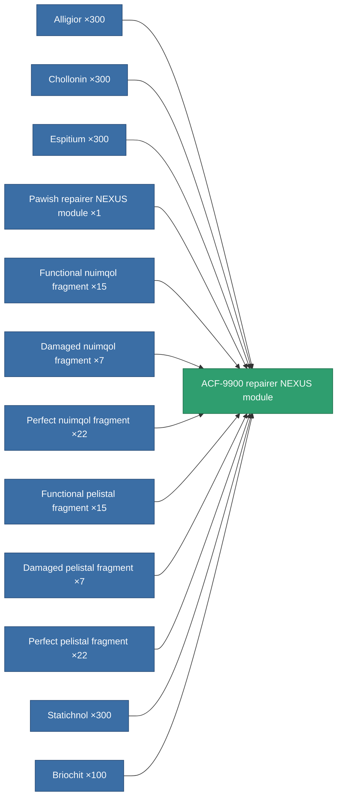

<!-- Generated by tools/generate from the live database (source: entitydefaults definition 2594, aggregatevalues via aggregatefields).
     Do not edit by hand; regenerate instead. -->

# ACF-9900 repairer NEXUS module

|  |  |
|---|---|
| Definition | `def_named3_gang_assist_maintance_module` |
| Tier | T4 |
| Health | 100 |
| Volume | 0.2 |
| Mass | 50 |
| Category | Modules / Enhancements |
| Tier line | [Standard repairer NEXUS module](/content/items/standard-gang-assist-maintance-module/) (T1) → [Diogan repairer NEXUS module](/content/items/named1-gang-assist-maintance-module/) (T2) → [Pawish repairer NEXUS module](/content/items/named2-gang-assist-maintance-module/) (T3) → **ACF-9900 repairer NEXUS module** (T4) |
| Note | repaired ammountot novel |

## Stats

| Field | Value |
|---|---|
| core_usage | 40 |
| cpu_usage | 95 |
| cycle_time | 10k |
| default_effect_range | 100 |
| effect_repair_amount_modifier | 1.075 |
| powergrid_usage | 40 |

<!-- production:generated -->
## Production

**Produced from 12 components, research level 7** — assemble the components to build it (see [Recipes](/content/recipes/) for the full list):

[All items](/content/items/)
