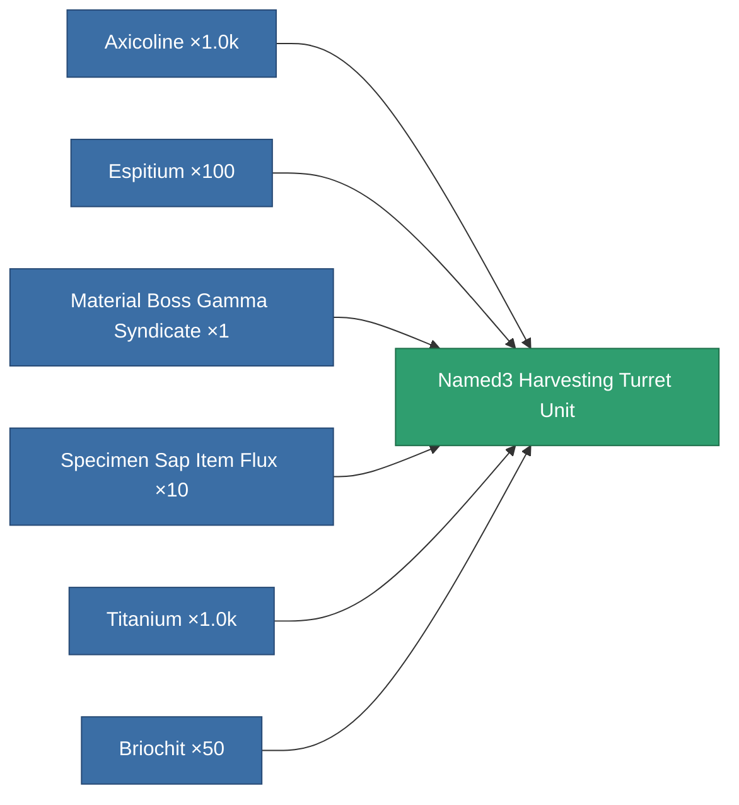

<!-- Generated by tools/generate from the live database (source: entitydefaults definition 8380, aggregatevalues via aggregatefields).
     Do not edit by hand; regenerate instead. -->

# Named3 Harvesting Turret Unit

|  |  |
|---|---|
| Definition | `def_named3_harvesting_turret_unit` |
| Tier | T4 |
| Health | 100 |
| Volume | 10 |
| Mass | 1 |
| Category | Special & other / Miscellaneous |
| Tier line | [Named1 Harvesting Turret Unit](/content/items/named1-harvesting-turret-unit/) (T2) → [Named2 Harvesting Turret Unit](/content/items/named2-harvesting-turret-unit/) (T3) → **Named3 Harvesting Turret Unit** (T4) |

## Stats

| Field | Value |
|---|---|
| cycle_time | 4.81k |
| harvesting_amount_modifier | 5.4905 |
| remote_control_bandwidth_usage | 4 |
| remote_control_lifetime | 300k |

<!-- production:generated -->
## Production

**Produced from 6 components, research level 5** — assemble the components to build it (see [Recipes](/content/recipes/) for the full list):

[All items](/content/items/)
