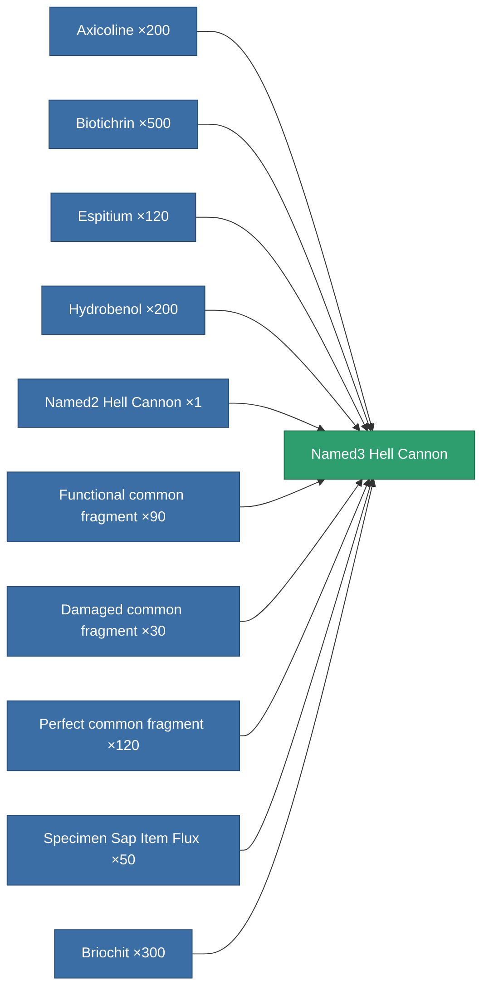

<!-- Generated by tools/generate from the live database (source: entitydefaults definition 848, aggregatevalues via aggregatefields).
     Do not edit by hand; regenerate instead. -->

# Named3 Hell Cannon

|  |  |
|---|---|
| Definition | `def_named3_hell_cannon` |
| Tier | T4 |
| Health | 100 |
| Volume | 1.8 |
| Mass | 1320 |
| Category | Modules / Weapons |
| Tier line | [Standard Hell Cannon](/content/items/standard-hell-cannon/) (T1) → [Named1 Hell Cannon](/content/items/named1-hell-cannon/) (T2) → [Named2 Hell Cannon](/content/items/named2-hell-cannon/) (T3) → **Named3 Hell Cannon** (T4) |

## Stats

| Field | Value |
|---|---|
| accuracy | 44 |
| core_usage | 2 |
| cpu_usage | 66 |
| cycle_time | 7k |
| damage_modifier | 2.42 |
| falloff | 25 |
| optimal_range | 17.5 |
| powergrid_usage | 234 |

<!-- production:generated -->
## Production

**Produced from 10 components** — assemble the components to build it (see [Recipes](/content/recipes/) for the full list):

[All items](/content/items/)
